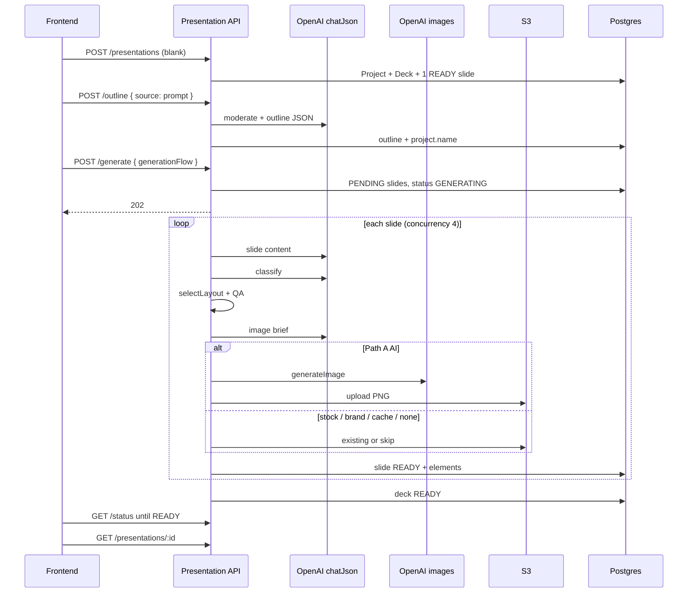

# AI PPT generation — complete internal guide

This document explains **how Athena VI generates AI presentations**, end to end: data model, every product entry path, every LLM/image step, layout compile vs rebind, credits, jobs, and what the frontend should poll.

It is written from the **backend implementation** (`src/modules/presentation/`). HTTP contracts stay in [`docs/api/PRESENTATION_API.md`](api/PRESENTATION_API.md). Frontend wiring stays in [`PRESENTATION_FRONTEND_INTEGRATION.md`](PRESENTATION_FRONTEND_INTEGRATION.md). Credits: [`PRESENTATION_CREDITS_FRONTEND.md`](PRESENTATION_CREDITS_FRONTEND.md). Prompt files: [`PRESENTATION_PROMPTS.md`](PRESENTATION_PROMPTS.md).

**Prompt bundle in code:** `PROMPT_BUNDLE_VERSION = "v1.8"` (`src/modules/presentation/prompts/index.js`).

---

## 1. What “AI PPT” is

A presentation is **not** a video `Project.data` blob. It is:

```
Workspace
  └── Folder
        └── Project (type: PRESENTATION)     ← URL id = presentationId
              └── Deck                         ← outline, theme, status, metrics
                    └── Slide[]                ← content JSON + imageRef + freeform canvas elements[]
                    └── DeckExport[]
                    └── SlideGenerationJob[] (per slide)
```

| Concept | Stored as | ID used in URLs |
|---------|-----------|-----------------|
| Presentation | `Project` with `type: PRESENTATION` | `presentationId` = **project id** |
| Deck | `Deck` (1:1 with project) | rarely in URLs |
| Slide | `Slide` | `slideId` |
| Canvas | `slide.elements` JSON | `element.id` inside the doc |
| Layout template | `Template` type `DECK_LAYOUT` | `templateId` / `layout_id` |
| Multi-slide pack | `Template` type `DECK_PACK` | `packId` |

The canvas the editor renders is always `slide.elements`:

```json
{
  "version": 1,
  "canvas": { "width": 1920, "height": 1080 },
  "elements": [
    { "id": "el_…", "type": "text", "role": "title", "slotId": "TITLE", "layer": 1, "placement": { "x": 80, "y": 80, "w": 800, "h": 120 }, "content": { "text": "…" } }
  ]
}
```

AI generation **fills** that canvas. It never accepts one mega “final deck JSON” as a create body.

### Caps

| Limit | Value | Where |
|-------|-------|--------|
| AI outline / generate | 5–20 slides | `AI_SLIDE_MAX` |
| Manual add / duplicate | 40 slides | `DECK_SLIDE_MAX` |
| Elements per slide | 50 | `MAX_ELEMENTS_PER_SLIDE` |
| Canvas 16:9 | 1920×1080 | native |
| Canvas 4:3 | 1600×1200 | native |
| 9:16 | **rejected** (400) | PPT only |

After AI fills ≤20 slides, the user can still add slides by hand up to 40.

### Status machines

**Deck:** `DRAFT` → `GENERATING` → `READY` | `FAILED`  
(`partial: true` when some slides READY and some FAILED.)

**Slide:** `PENDING` → `GENERATING` → `READY` | `FAILED`

**Export:** `QUEUED` → `RENDERING` → `READY` | `FAILED`

**Job:** `PENDING` | `RUNNING` → `SUCCEEDED` | `FAILED`

---

## 2. Module map (who does what)

Mounted at `/api/workspaces/:workspaceId/presentations` from `workspace.routes.js` (Bearer + workspace OWNER/ADMIN/MEMBER).

| File | Role |
|------|------|
| `presentation.routes.js` | HTTP verbs, multer for outline PDF/DOCX |
| `presentation.controller.js` | req/res → service |
| `presentation.service.js` | Create, list, get, pack clone, brand apply, add-slide+AI, passthrough |
| `deckGeneration.service.js` | **The AI engine:** outline, generate, per-slide pipeline, regenerate |
| `generationFlow.service.js` | Wizard snapshot → generate context (theme, image mode, brief, canvas) |
| `layoutSelector.service.js` | Score layouts for a content type + density |
| `layoutQa.service.js` | Truncate copy to slot `max_words` / `max_lines` / `max_items` |
| `layoutToElements.js` | Slot schema → canvas **or** rebind text/images into existing canvas |
| `slideEditor.service.js` | Manual add/delete/duplicate/reorder, canvas CRUD |
| `slideMedia.service.js` | Upload / attach asset / insert stock onto a slide |
| `documentParse.service.js` | PDF/DOCX text extract for outline |
| `theme.service.js` | Catalog themes + contrast |
| `presentationCredit.service.js` | Afford + charge (`ppt_*`) |
| `presentationRateLimit.service.js` | Redis generate/regenerate buckets |
| `imageCache.service.js` | Hash brief → reuse S3 image |
| `export.service.js` | PPTX / PDF / PNG / JPEG |
| `prompts/*.js` | LLM system/user builders |
| `shared/services/ai/` | OpenAI: `chatJson`, `generateImage`, `moderateText`, `checkImageRelevance` |

Supporting: Brand Kit (`brandKit.service.js`), stock (`stock.service.js`), S3, inbox notifications.

---

## 3. Every way a presentation can be created

`POST /api/workspaces/:workspaceId/presentations`

| `createMode` | What happens | Typical next step |
|--------------|--------------|-------------------|
| **`blank`** (default) | 1 READY slide, default title text + optional brand logo | AI outline → generate, **or** manual edit |
| **`template`** | 1 READY slide compiled from a `DECK_LAYOUT` | Manual edit; optional later AI |
| **`pack`** | N READY slides cloned from a `DECK_PACK` (designed canvas or layout compile) | Edit as-is, **or** outline → generate to fill placeholders |

Optional on create: `themeId` / `themeTokens`, `brandKitId`, `aspectRatio` (`16:9` \| `4:3`), `locale`, `folderId` (required), `title`/`name` (defaults to **Untitled Presentation**).

Brand Kit **wins** over catalog theme at create. Pack `schema.themeId` is used if no kit and no explicit theme.

### 3.1 Blank

- `blankCanvas({ withDefaultText: true })` at the aspect canvas size.
- `injectBrandLogo` if a kit logo exists (`force: true` on title slides).
- Slide marked `manuallyEdited: false` so later generate treats it as a **blank starter** and re-queues it.

### 3.2 Single layout template

- Load active `DECK_LAYOUT`.
- `layoutSlotsToElements(schema, { title }, null, canvas, { themeTokens })`.
- Slide `manuallyEdited: true` (user started from a designed layout).

### 3.3 Deck pack clone

For each pack slide:

1. Resolve `layout_id` → layout schema (unless a canvas **snapshot** exists).
2. Fill `slotImageUrls` from `TemplateMedia` (`slotHint` like `slide:1:HERO_IMAGE`).
3. If `snapshot.elements` exists (canvas-published pack): deep-clone the designed canvas and optionally **rebind** placeholder text/images.
4. Else: compile from layout slots + `designTokens`.
5. Inject brand logo.
6. Persist `content` with `intent`, `designTokens`, `generationHints` from the pack slide.
7. Slides are `READY` + `manuallyEdited: true`.

`generationMetrics.deckPack = { packId, pack_id, brandKitId }` is stored so later outline/generate know this deck is pack-bound.

Canvas-published packs (`meta.authoredVia: "canvas"`) with role-tagged elements / `meta.aiReady` are the ones generate **rebinds in place** instead of throwing away the design.

---

## 4. Product flows (all generation sorts)

### Flow A — Wizard AI (blank → outline → generate)

This is the main “Create with AI” path.

```
1. POST  .../presentations          { folderId, createMode: "blank", themeId?, brandKitId? }
2. GET   .../credit-estimate        (optional UI)
3. POST  .../outline                { source: "prompt"|"outline"|"document", … }
4. PATCH .../outline                (optional user edits to cards)
5. POST  .../theme                  (optional catalog theme)
6. POST  .../generate               202 + optional generationFlow
7. GET   .../status                 poll until READY / FAILED
8. GET   .../presentations/:id      open canvas
```

`generationFlow` is additive. Without it, generate still works from outline + deck theme. With it, wizard selections (tone, color theme, image type, canvas, pack, brand kit) are persisted and applied.

### Flow B — Pack + AI fill

```
1. GET   .../presentation-deck-packs
2. GET   .../presentation-deck-packs/:packId
3. POST  .../presentations          { createMode: "pack", packId, brandKitId? }
4. POST  .../outline                (pack skeleton + LLM titles/summaries)
5. POST  .../generate               generationFlow.selections.packId + brandKitId
```

Outline **does not invent slide count/order**. Generate re-queues pack slides as PENDING and fills copy + images into the designed layouts.

### Flow C — Blank / template, then AI one slide

```
POST .../slides  { generate: true, prompt: "…", target: "all"|"content"|"image" }
```

Creates a slide, then runs the **same regenerate pipeline** asynchronously.

### Flow D — Regenerate an existing slide

```
POST .../slides/:slideId/regenerate
{ "target": "all"|"content"|"image"|"full", "prompt": "…", "overwriteManualEdits": true }
```

`full` is aliased to `all`. Reuses saved `generationFlow` from `deck.generationMetrics`.

### Flow E — No AI (Canva-style)

Create blank/template/pack → palette/canvas CRUD → export. No outline/generate required.

### Flow F — Document-to-deck

Outline `source: "document"` with multipart `file` (PDF/DOCX, max 20 MB) or `documentText`. Then same generate as Flow A.

---

## 5. Outline generation (step by step)

**Route:** `POST .../presentations/:id/outline`  
**Code:** `deckGeneration.generateOutline`

### 5.1 Inputs

| `source` | Required | Notes |
|----------|----------|--------|
| `prompt` | `prompt` string (max 8000) | Flatten voice/tone/audience into this string **and/or** send `voiceAndTone` / `audience` / `purpose` fields |
| `outline` | `outlineText` (max 50k) | User already has a rough outline |
| `document` | `file` and/or `documentText` | PDF via `pdf-parse`, DOCX via `mammoth`; truncated at `PPT_DOCUMENT_MAX_CHARS` (default 100k) |

Also: `slideCount` (default 12, 5–20), `density` (`concise` \| `balanced` \| `detailed`), `locale`.

### 5.2 Guards

1. Rate limit: `assertGenerateAllowed` (same Redis bucket as full generate — see §15).
2. Project must be `PRESENTATION` in this workspace.
3. OpenAI **moderation** on source text. Flagged → 400 `PRESENTATION_CONTENT_BLOCKED`.
4. Credit **afford** using outline **estimate** (token assumptions, not yet actual usage). Insufficient → **402**.

### 5.3 Two outline modes

**Free outline (no pack on the deck)**

- Model: `PPT_OUTLINE_MODEL` (default `gpt-4.1`) via `chatJson` (`response_format: json_object`).
- Prompt: `outline.prompt.js` `buildSystem` + `buildUser`.
- LLM invents: deck `title`, N slides with `order`, `title`, `summary`, `suggestedContentType`.
- Rules in the prompt: slide 1 = `title`; last prefers `closing`; cap consecutive `bullet_list`; prefer `image+text`; titles ≤8 words; summaries ≤25 words.
- `normalizeOutline` then:
  - Force first slide `suggestedContentType = title` if missing/`bullet_list`.
  - Cap slides at 20.
  - `sanitizePresentationTitle`: reject “Create a presentation about…” style titles → `Untitled Presentation`; max 12 words / 255 chars.
  - `preferVisuals`: true unless source text says “no images / text-only / …”.

**Pack enrich (deck already has `generationMetrics.deckPack.packId`)**

- Slide count = pack slide count (user `slideCount` ignored).
- Skeleton from pack: order, placeholder titles, `layoutId`, `intent`, `suggestedContentType` — **fixed**.
- LLM uses `buildPackEnrichSystem` + `buildPackEnrichUser`: only rewrite title + summary; must not change layout/type/intent.
- Merge: skeleton structure + LLM wording.

If a brand kit is stored on the deck, its **voice brief** is appended to `voiceAndTone` for both modes.

### 5.4 Persist + charge

1. `project.name` ← outline title (so the library card updates immediately).
2. Deck: `outline`, `locale`, `promptBundleVersion`, status back to `DRAFT` if it was `READY`.
3. Charge **`ppt_outline`** with **reconciled** token usage (`chargeOutlineReconcile`), idempotency key hashed from source + density + slide count.
4. Response includes `presentation: { id, title }`, `outline`, `creditsCharged`.

### 5.5 Patch outline (no LLM)

`PATCH .../outline` with the full outline object. Blocked if deck is `GENERATING` (409). Re-normalizes, updates project name. **No credit charge.**

---

## 6. Wizard `generationFlow` (how UI choices become generate context)

Sent on `POST .../generate` as optional `generationFlow`. Persisted on `deck.generationMetrics.generationFlow`.

Resolved by `generationFlow.resolveFlowToGenerateCtx`.

### 6.1 Selections the backend understands

| Field | Effect |
|-------|--------|
| `prompt` | Extra user prompt into slide content LLM (`userPrompt`) |
| `title` | Updates `project.name` at generate start |
| `outlineNotes`, `voiceAndTone`, `audience`, `purpose`, `style`, `color`, `industries`, `baseTemplate`, `imageStyle` | Concatenated into **wizardBrief** string injected into content / classify / image-brief prompts |
| `colorTheme` | Wizard palette (`wizardColorThemes.json`) → `themeTokens` (hyphens; underscores converted) |
| `canvasSize` | `16:9` or `4:3` → deck `aspectRatio` + pixel canvas |
| `imageType` | See §8 |
| `imageStyle` + `imageStyleFilter` | Phrase like “cinematic environmental scene photography, photorealistic” |
| `textContent` / `density` | Maps minimal/concise → `concise`; detailed/extensive → `detailed` |
| `slideCount` | **Metadata only.** Does **not** add/remove slides. Outline slides are source of truth. |
| `locale` | Deck locale |
| `packId` | Bind generate to a `DECK_PACK` (whitelist + narrative + defaults) |
| `brandKitId` | Load kit tokens, merge over wizard theme, brand voice into brief, prefer kit photos |

`availableOptions` is stored for telemetry; not used in generation.

### 6.2 Image type → `imageSource`

| `imageType` | `preferVisuals` | `imageSource` | Images charged? |
|-------------|-----------------|---------------|-----------------|
| `ai` (default) | true | `ai` | Path A (or Path B) |
| `stock` / `web` | true | `stock` | Path A (stock only; fail if none) |
| `placeholders` | true | `placeholder` | No |
| `none` | false | `none` | No |

### 6.3 Base template bias

Wizard `baseTemplate` ids `corp-pitch`, `marketing`, `social`, `portfolio` bias layout selection toward `image+text` and image slots.

### 6.4 Density

Priority: top-level generate `density` → `selections.density` → mapped `textContent` → outline density → `'balanced'`.

Density caps used in **slide content prompt** (not a hard parser cap except layout QA):

| Density | Max bullets | Max body words | Max title lines |
|---------|-------------|----------------|-----------------|
| concise | 3 | 40 | 1 |
| balanced | 5 | 60 | 2 |
| detailed | 7 | 100 | 2 |

---

## 7. Full deck generate (async)

**Route:** `POST .../generate` → **202**  
**Code:** `startGenerate` then `setImmediate(processDeckGeneration)`

### 7.1 Start (`startGenerate`) — synchronous part

1. 409 if already `GENERATING`.
2. 400 if no outline slides.
3. Rate limit generate bucket.
4. Resolve `generationFlow` + load pack/brand (`loadPackAndBrandForGenerate`).
5. Estimate cost = `slideCount × (ppt_slide_content + ppt_image_path_a)` and **assertAfford** (402 if not). Actual Path B is more expensive; estimate is Path A.
6. Build `requestHash` from deck id + prompt bundle + density + outline JSON + overwrite flag + flow selections (idempotency / metrics).
7. **Queue slides** (the important branching):

| Mode | What happens to existing slides |
|------|----------------------------------|
| `overwriteManualEdits: true` | Delete **all** slides, create PENDING rows from outline |
| Pack mode | Delete slides whose `order` is not in the outline; re-queue matching orders to PENDING; create missing orders |
| Default (blank AI) | Delete non-`manuallyEdited` slides; re-queue **blank starter** slides (`isBlankStarterSlide`); **preserve** real manual edits; create PENDING for remaining outline orders |

Blank starter = `manuallyEdited` but no `layoutId` and only placeholder/empty text (the create-blank default slide).

8. Apply flow title, `preferVisuals`, theme tokens, aspect ratio, locale.
9. Deck status → `GENERATING`, `partial: false`, metrics: `startedAt`, `generationFlow`, `deckPack`, `resolved` snapshot.
10. Return `{ deckId, status: "GENERATING", slideCount, estimatedCredits }`.
11. Background: `processDeckGeneration`.

### 7.2 Background (`processDeckGeneration`)

1. Rebuild ctx (density, locale, outline, theme, wizardBrief, imageSource, canvas, pack whitelist, `forceTextReplace: true`).
2. Pack + AI: `forceImageRefresh` true (unless imageType none/placeholder) so pack seed photos get replaced by AI/stock/brand.
3. Persist resolved theme tokens on the deck.
4. Take all slides with status `PENDING` or `GENERATING`.
5. Process them with a worker pool: `PPT_SLIDE_CONCURRENCY` (default **4**).
6. Refresh deck. Set:
   - all failed → deck `FAILED`
   - mix → `READY` + `partial: true`
   - all ready → `READY`
7. Inbox notification `PRESENTATION_GENERATION_COMPLETED` or `_FAILED` with `actionUrl` to the presentation.

A thrown error in the orchestrator also marks the deck FAILED and notifies.

### 7.3 Pack + brand load (`loadPackAndBrandForGenerate`)

If `packId` (from flow or stored metrics) is an active `DECK_PACK`:

- `layoutIdWhitelist` from `generationDefaults.layoutWhitelist` or every slide `layout_id`
- Pack narrative appended to wizardBrief
- `contentDistribution` (e.g. max consecutive bullet slides)
- `packSlides` (intent, hints, designTokens, snapshot)
- Optional pack `themeId` if no tokens yet
- Pack `imageStyle` / `preferVisuals` / `baseTemplate` as fallbacks

If `brandKitId`: load kit tokens, **merge over wizard theme**, append brand voice brief. Failures are logged; generate continues without kit.

---

## 8. Per-slide pipeline (`processSlide`)

This is the core. Each PENDING slide independently:

```
PENDING → GENERATING
  1. Content LLM          (charged ppt_slide_content)
  2. Classify LLM         (not charged)
  3. Visual policy + layout select + QA truncate
  4. Image brief LLM      (not charged)
  5. Resolve image        (charged ppt_image_path_a / _b / cache 0)
  6. Extra slot images    (device grids etc.)
  7. Compile or rebind canvas + brand logo
READY (or FAILED)
```

Timeout on content LLM: `PPT_SLIDE_CONTENT_TIMEOUT_MS` (default 45s) → 504 for that slide (slide FAILED; deck may still be partial READY).

Every LLM/image step is a **`SlideGenerationJob`** with unique `requestHash`. Duplicate hash → skip work and skip charge (retries / worker overlap).

### 8.1 Content LLM

**Skip / reuse** if a CONTENT job already succeeded **and** existing `content` is not placeholder (`contentNeedsFreshGeneration`). Pack-bound or `forceTextReplace` still refreshes placeholder pack copy.

Prompt: `slideContent.prompt.js`. Inputs include:

- Deck title, density caps, slide order / neighbors
- Outline title + summary
- Pack `intent` + `generationHints`
- Layout **slot constraints** (max lines/words) when pack layout is known early
- `layoutContext` (overlay risk, shape hints)
- Wizard brief

Output JSON fields the renderer understands: `title`, `subtitle`, `body`, `bullets`, `stats`, `columns`, `quote`, `chart`, `table`, `members`, `plans`, `contact`, `agenda`, `comparison`, `timeline`, `notes`, `pathBSpec`, `shapeDecisions`.

Then `applyGenerationHints` truncates title/body/bullets/stats to pack hint maxima.

Charge: **`ppt_slide_content`** (flat, default 2 AC).

### 8.2 Classify LLM

Prompt: `classify.prompt.js`. Temperature 0.2.

Returns `{ content_type, visual_need }`.

**content_type** one of:

`title | agenda | bullet_list | comparison | stat | quote | image+text | timeline | team | chart | closing | section_divider | grid | pricing | device_frames`

**visual_need** one of:

`none | photo | illustration | icon | chart | diagram_template | path_b`

Classify failure is **non-fatal**: fall back to outline type / `bullet_list` and `photo` if visuals preferred.

Overrides after classify:

- Pack layout with image slots and `visual_need none` → force `photo`
- Non-pack **slide 1** → force `content_type: title`

### 8.3 Visual policy (`applyVisualPolicy`)

When `preferVisuals` is on (default):

- `path_b` and `chart` are left specialized.
- `none` / `icon` / `diagram_template` are upgraded to `photo` (or `illustration` for quote/stat).
- Many types (`bullet_list`, `comparison`, `stat`, `timeline`, `team`, `section_divider`) have **layout** type remapped to `image+text` so a photo slot exists.
- `title`, `agenda`, `closing`, `quote`, `grid`, `pricing`, `device_frames` keep their own layouts.
- Wizard `baseTemplateBias` can force `image+text`.

`applyContentDistribution` can break a streak of `bullet_list` if the pack says `maxConsecutiveBulletSlides`.

### 8.4 Layout selection

Skipped when the slide **will rebind** an existing role-tagged canvas (pack snapshot or current elements with rebind roles) — unless `shouldRecompileLayout` says the layout is too complex.

Otherwise:

1. If pack whitelist contains the existing `layoutId`, keep it.
2. Else `resolveLayoutTemplates(layoutContentType, { layoutIdWhitelist })`:
   - DB active `DECK_LAYOUT`s for that `contentType`
   - Fallback: `seed-layouts.json`
   - Fallback: any active layout
   - If whitelist: filter; if empty, load those layout ids anyway
3. `selectLayout` scores templates:
   - **−100** if same as previous slide’s layout (avoid identical consecutive layouts)
   - **+50 / −40** if `preferImageSlot` and template has / lacks image slot
   - Extra score for chart/table/pricing/team/agenda/device/stat/grid match vs content arrays
   - Density: lots of bullets prefer dense/high `max_items` layouts
4. `validateSlide` truncates strings/bullets to slot caps.

If classify type has no image slot but policy wants one, selector falls back to `image+text` templates.

### 8.5 Image brief LLM

Skipped if `imageSource` is `none`/`placeholder`, or `visual_need` is `none|chart|icon|diagram_template`.

Prompt: `imageBrief.prompt.js`. Asks for concrete nouns, not “growth/success”. Honors:

- Author `content.imagePrompt` or `generationHints.imagePromptStyle` (pack-authored)
- Overlay → darker exposure
- Device layouts → flat UI screenshot, **no device bezel** in the image
- Theme image style + color treatment (color treatment omitted when a brand kit is applied)

Output: `{ subject, image_type, composition, search_query, negative_terms, alt_text, exposure_hint }`.

If `exposure_hint === "dark"` and the layout has a hero/background image, content gets `shapeDecisions.__overlay__ = { enabled: true, scrim: 0.45 }` so the compiler can drop a scrim for light text.

Brief failure → fallback `{ subject, search_query }` from author prompt or slide title.

### 8.6 Compile vs rebind (canvas write)

After images:

**Rebind** (keep designed positions): used when there is a pack snapshot or current elements with roles (`title`, `heading`, `body`, `image`, …) **and** we are **not** doing a fresh compile.

**Fresh compile** (`layoutSlotsToElements`): used when

- `shouldRecompileLayout` is true: `grid_metrics`, `grid_device`, `device_*`, **more than one image slot**, **>3** heading/body/stat text slots, or overlapping text placements, **or**
- pack-bound **and** a layout schema with slots exists (`useFreshCompile`), **or**
- there is a layout schema and no rebind base.

Rebind maps LLM fields onto existing elements by `role` / `slotId` / id heuristics; replaces placeholder text (`Your Title`, `Lorem ipsum`, …) or all text when `forceTextReplace`. Images update by slot; logos are left alone.

Then `injectBrandLogo` (forced when pack-bound or kit present).

Persist: `status READY`, `content`, `contentType`, `layoutId`, `imageRef`, `elements`.

On any thrown error: slide `FAILED` with `imageRef.status: failed`. Other slides keep going.

---

## 9. Image resolution (`resolveSlideImage`) — all branches

Order of decisions:

```
imageType=none            → skipped, no charge
imageType=placeholders    → system gray PNG on S3, no charge
visual_need in none|chart|icon|diagram_template → skipped
brand kit photo match     → use kit photo, no charge
existing ready media      → keep (unless forceImageRefresh / pack-bound template seed)
visual_need=path_b        → HD AI image (ppt_image_path_b, default 9 AC)
else Path A:
  cache hit               → reuse URL (0 AC)
  imageType=stock         → Pexels/etc; vision must pass or 502
  imageType=ai (default)  → OpenAI image; on failure try stock
  then vision score (non-fatal for AI)
  write PresentationImageCache
  charge ppt_image_path_a (default 4 AC)
```

### 9.1 Brand photos

`pickBrandPhoto` scores kit photos by token overlap of `name`/`role` vs search query. First photo is used if nothing matches. Presign or public URL.

### 9.2 Keep existing

If `imageRef.status === ready` and not `forceImageRefresh`, and not (pack-bound + source `template`/`pack`), reuse. Pack generate **does** refresh template seeds so AI can replace pack stock.

### 9.3 Path B (bespoke diagram)

Triggered only when classify (or content) sets `visual_need: path_b`. Intended for multi-panel architecture/ERD/process infographics that layouts cannot express.

- Content LLM should have filled `pathBSpec` (panels, labels, legend).
- `pathB.prompt.js` turns that spec into a typesetting prompt (the image model must not invent copy).
- `generateImage` quality **hd** / high.
- Charge `ppt_image_path_b`.

### 9.4 Path A (normal photo/illustration)

1. Hash brief: `searchQuery | imageStyle | colorTreatment | tier`.
2. Cache table `PresentationImageCache` — hit charges `ppt_image_cache_hit` at **0 AC**.
3. **Stock mode:** `stockService.searchStock` → download preview → upload to  
   `presentations/{workspaceId}/{deckId}/images/{slideId}-{uuid}.jpg`  
   Vision: if `relevant === false`, discard and **throw** (no silent AI fallback in stock mode).
4. **AI mode:** `generateImage` (`PPT_IMAGE_MODEL`, default `gpt-image-1`, quality medium). Prompt = subject + composition + style phrase + negative terms. On AI failure, **try stock**; if that also fails, rethrow AI error. Vision score is stored on the job but does **not** discard AI images.
5. Upload PNG to the same S3 prefix.
6. Put cache (ignore unique races).
7. Charge `ppt_image_path_a`.

### 9.5 Extra slot images (`enrichContentSlotImageUrls`)

Layouts with multiple image slots (grids, device frames):

1. Fill from pack `TemplateMedia` by `slotHint`.
2. Remaining slots: generate from `content.imagePrompts[slotId]` (device slots append “no phone/laptop bezel”).
3. If exactly one slot still empty, assign the main `imageRef.url`.

Device screens get a “flat UI screenshot only” suffix so the **layout** draws the phone/laptop frame.

### 9.6 Vision relevance

`checkImageRelevance` (`PPT_VISION_MODEL` or slide model) with `visionRelevance.prompt.js` rules: fail if score &lt; 0.6 or only topically adjacent. Used to reject **stock** in stock mode; AI path only records the score.

---

## 10. Single-slide regenerate

**Route:** `POST .../slides/:slideId/regenerate` → 202  
**Code:** `regenerateSlide`

| `target` | What is reset | What runs |
|----------|---------------|-----------|
| `all` / `full` | content (seeded from prompt or existing title), layoutId, elements, imageRef | Full `processSlide` |
| `content` | content, layoutId, elements (image kept until processSlide may refresh) | Full `processSlide` |
| `image` | imageRef only | **Short path:** classify + brief + `resolveSlideImage`; swap image elements in existing canvas |

Guards:

- 409 if `manuallyEdited` and `overwriteManualEdits` is false.
- 400 if content/all and no prompt and no existing title.
- Rate limit: **regenerate** bucket (more generous).
- Afford: 1× content + 1× Path A (image-only skips content AC; content-only skips image AC).

Prompt: first line becomes a seed title (max 120 chars).

Image-only on failure still marks the slide `READY` but `imageRef.status: failed` (does not FAIL the slide). Full path uses `processSlide` (can FAIL the slide).

Add-slide with `generate: true` is this same function after inserting a blank/layout slide.

---

## 11. Layout compile internals (what the canvas contains)

`layoutSlotsToElements` walks `layoutSchema.slots`:

- Region `{ x, y, w, h }` in 0–1 (or 12-col grid) → pixel `placement` on the canvas.
- Slot roles become element `type`: text, image, shape, chart, table, device frame.
- Theme palette + pack `designTokens` color fills, type scale, overlay light text.
- `shapeDecisions` from the LLM add cards/pills/masks/scrims at runtime (`applyRuntimeShapeDecisions`).
- Device slots: layout draws bezel; image is the **screen** inset.

Element types the editor/export understand: `text`, `image`, `shape`, `icon`, `chart`, `table`, `embed`.

Shape kinds: rect, rounded-rect, circle, ellipse, pill, triangle, diamond, star, line, plus, arrows, flow-process, flow-decision.

---

## 12. Themes, Brand Kits, logos

### Catalog theme

`POST .../theme` → `theme.service.resolveThemeTokens`. Contrast is asserted on palette pairs.

Wizard `colorTheme` at generate **overrides** the deck theme for that run.

### Brand Kit

Applied at create, at generate (`selections.brandKitId`), or later `POST .../apply-brand-kit`.

Apply-brand-kit: blocked if GENERATING; replaces `deck.themeTokens`; injects/updates `role: logo` on every slide; **does not rewrite body copy**.

Logo pick: `pickLogoForBackground` (light vs dark logo variants). `injectBrandLogo` places or updates a logo image element.

Kit photos are preferred in Path A **before** AI/stock. Kit voice is injected into outline + wizardBrief. Color treatment from the wizard is **not** applied on top of a kit (so brand colors stay clean).

---

## 13. Manual editor (not AI, but part of the PPT loop)

Blocked while deck `GENERATING` (409).

| Action | Notes |
|--------|--------|
| Add slide | Blank canvas or compile from `templateId`; `manuallyEdited: true`; max 40 |
| Duplicate / delete / reorder | Must keep ≥1 slide |
| Apply layout | Recompile current content into a new layout schema |
| PUT canvas | Whole `{ version, canvas, elements }` replace |
| Element CRUD | Palette presets (`elements/catalog.json`) or raw element; max 50 |
| PATCH slide | content/title/background/elements; marks `manuallyEdited` |
| Upload media / attach asset / insert stock | Writes into an image element + `imageRef` |

GET presentation/slide **presigns** S3 URLs (~1 hour). Prefer `elements[].content.url` for render.

---

## 14. Export

`POST .../export` `{ format, slideId? }` → 202.

Formats: `PPTX` | `PDF` | `PNG` | `JPEG`. Optional `slideId` = single slide.

Background: render → S3 `presentations/{workspaceId}/{deckId}/exports/{exportId}.{ext}` → charge `ppt_export` (default 3 AC) → inbox notify.

PPTX uses `pptxgenjs` from **elements** when present, else legacy `content` fields. PDF/raster use HTML + headless browser.

Poll `GET .../export/:exportId` for `status` + download URL when READY.

---

## 15. Credits (charge-on-success)

Same workspace credit pool as video, **different feature keys**.

| Feature | When | Default AC |
|---------|------|------------|
| `ppt_outline` | After outline LLM success | Token USD × margin × AC/USD (reconcile) |
| `ppt_slide_content` | After each slide content LLM | 2 |
| `ppt_image_path_a` | After Path A image success | 4 |
| `ppt_image_path_b` | After Path B image success | 9 |
| `ppt_image_cache_hit` | Cache reuse | 0 |
| `ppt_export` | After file uploaded | 3 |

- **Pre-check** estimate may 402 even if later some slides fail (failed **pieces** are not charged).
- Idempotency keys: `ppt:outline:…`, `ppt:content:{hash}`, `ppt:path_a:{hash}`, `ppt:path_b:{hash}`, `ppt:export:{exportId}`.
- Duplicate `SlideGenerationJob.requestHash` → no second charge.
- `deck.creditsChargedSoFar` increments as pieces succeed.
- Classify, image brief, vision: **not** billed as separate features.

`GET .../credit-estimate?slideCount=` returns outline estimate + generate (N × content+Path A) + export + total. Does not charge.

---

## 16. Rate limits (Redis)

| Action | Default | Env |
|--------|---------|-----|
| Outline + full generate | 10 / hour **per user and per workspace** | `PPT_GENERATE_RATE_LIMIT_MAX` / `_WINDOW_SEC` |
| Regenerate (and add-slide generate) | 30 / hour per user and workspace | `PPT_REGENERATE_RATE_LIMIT_MAX` / `_WINDOW_SEC` |

Both user **and** workspace buckets must be free. 429 + `retryAfterSec`.

---

## 17. Models and env

| Concern | Env | Default |
|---------|-----|---------|
| Outline LLM | `PPT_OUTLINE_MODEL` | `gpt-4.1` |
| Slide / classify / brief | `PPT_SLIDE_MODEL` | `gpt-4.1-mini` |
| Images | `PPT_IMAGE_MODEL` | `gpt-image-1` |
| Vision | `PPT_VISION_MODEL` | slide model |
| Slide concurrency | `PPT_SLIDE_CONCURRENCY` | 4 |
| Content timeout | `PPT_SLIDE_CONTENT_TIMEOUT_MS` | 45000 |
| Document extract cap | `PPT_DOCUMENT_MAX_CHARS` | 100000 |
| Requires | `OPENAI_API_KEY` | — |

All LLM calls use `chatJson` → OpenAI Chat Completions with `response_format: json_object`. Images use Images API `b64_json`, then S3.

---

## 18. Jobs, hashes, and why retries are safe

`SlideGenerationJob.requestHash` is unique. `beginJob`:

- Existing hash → `{ duplicate: true }` → skip LLM/image and skip charge.
- Create RUNNING; unique race `P2002` → treat as duplicate.

Hash inputs typically: job type + slide id + `PROMPT_BUNDLE_VERSION` + content fingerprints.

This is how overlapping workers and client retries do not double-bill.

---

## 19. Status polling contract

`GET .../status`

```json
{
  "deckId": "…",
  "status": "GENERATING",
  "deckStatus": "GENERATING",
  "partial": false,
  "progress": 40,
  "etaSeconds": 24,
  "creditsChargedSoFar": 12,
  "slides": [
    { "id": "…", "order": 1, "status": "READY", "contentType": "title", "layoutId": "…", "manuallyEdited": false }
  ]
}
```

- `progress` = round(terminal slides / total × 100). Terminal = READY or FAILED.
- `etaSeconds` = remaining × 4 (heuristic, not a real scheduler).
- Image failure on a READY slide: `imageRef.status: failed` + `imageRef.error` (full generate). Poll GET presentation for `elements` when a slide flips READY.

Inbox also fires when the **deck** finishes.

---

## 20. Prompt modules (what each LLM is told)

| Module | File | Charged? | Job type |
|--------|------|----------|----------|
| Outline | `outline.prompt.js` | yes `ppt_outline` | (deck-level, not a slide job) |
| Slide copy | `slideContent.prompt.js` | yes `ppt_slide_content` | `CONTENT` |
| Classify | `classify.prompt.js` | no | `CLASSIFY` |
| Image brief | `imageBrief.prompt.js` | no | `IMAGE_BRIEF` |
| Path B typeset | `pathB.prompt.js` | bundled into Path B image | `IMAGE_PATH_B` |
| Vision | `visionRelevance.prompt.js` | no | score on image jobs |

Bump `PROMPT_BUNDLE_VERSION` when wording or JSON schema changes in a way that should invalidate caches/metrics (`docs/PRESENTATION_PROMPTS.md`). Current code version is **v1.8**.

---

## 21. End-to-end sequence (wizard AI)



---

## 22. Decision cheat sheet

| Question | Answer |
|----------|--------|
| What IDs do I poll? | `presentationId` = project id. Status is under that. |
| When is generate allowed? | Outline with ≥1 slide; not already GENERATING; under rate limit; enough AC. |
| Does generate wipe my edits? | Only if `overwriteManualEdits: true`, or the slide is a blank starter / unused AI row. Real `manuallyEdited` slides are kept in default mode. Pack mode re-queues pack orders. |
| Why didn’t slide count change when I set wizard slideCount? | Outline slides win. Change outline (or regenerate outline with `slideCount`) first. |
| Why is the title still “Untitled Presentation”? | Outline sanitizer rejected a prompt-like title, or outline was skipped. |
| Why did layout change on generate? | Free AI **compiles** from scored layouts. Packs with role-tagged canvas **rebind** unless the layout is grid/device/multi-image. |
| Why no photos? | `imageType: none`, or prompt said “no images”, or Path A failed (`imageRef.status: failed`). |
| Why gray boxes? | `imageType: placeholders`. |
| Why brand photos instead of AI? | Kit photos are preferred whenever they exist. |
| Why consecutive slides look different? | Selector penalizes repeating the previous `layoutId`. |
| Why 409? | Deck GENERATING, or regenerate on a manually edited slide without overwrite. |
| Why 429? | Generate/regenerate Redis buckets. |
| Why 402? | Workspace cannot afford the **estimate** (not necessarily the final charge). |

---

## 23. Related docs

| Doc | Use |
|-----|-----|
| [`docs/api/PRESENTATION_API.md`](api/PRESENTATION_API.md) | Paths, bodies, status codes |
| [`PRESENTATION_FRONTEND_INTEGRATION.md`](PRESENTATION_FRONTEND_INTEGRATION.md) | UI steps, canvas contract |
| [`FRONTEND_PPT_IMAGE_BRAND_KIT_A_TO_Z.md`](FRONTEND_PPT_IMAGE_BRAND_KIT_A_TO_Z.md) | PPT + Image Gen + Brand Kit together |
| [`PRESENTATION_CREDITS_FRONTEND.md`](PRESENTATION_CREDITS_FRONTEND.md) | AC UX |
| [`PRESENTATION_PROMPTS.md`](PRESENTATION_PROMPTS.md) | When to bump prompt bundle |
| [`docs/api/BRAND_KIT_API.md`](api/BRAND_KIT_API.md) | Kit CRUD |
| [`docs/api/ENVIRONMENT.md`](api/ENVIRONMENT.md) | PPT_* env vars |

**Eval:** `npm run eval:presentation` (offline export/prompt checks; live eval gated by `PPT_EVAL_LIVE`).
