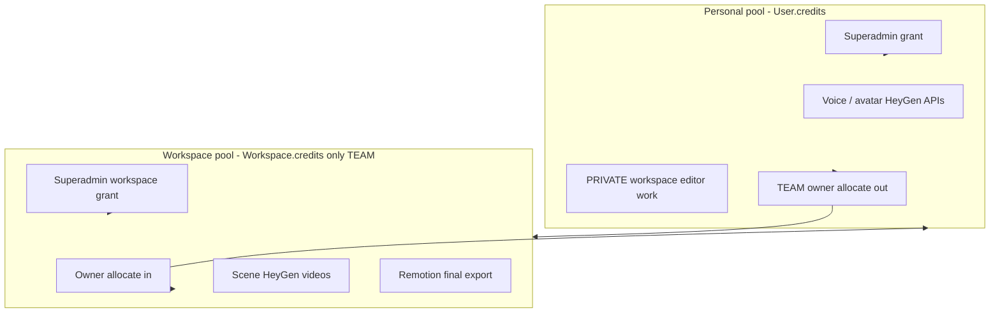
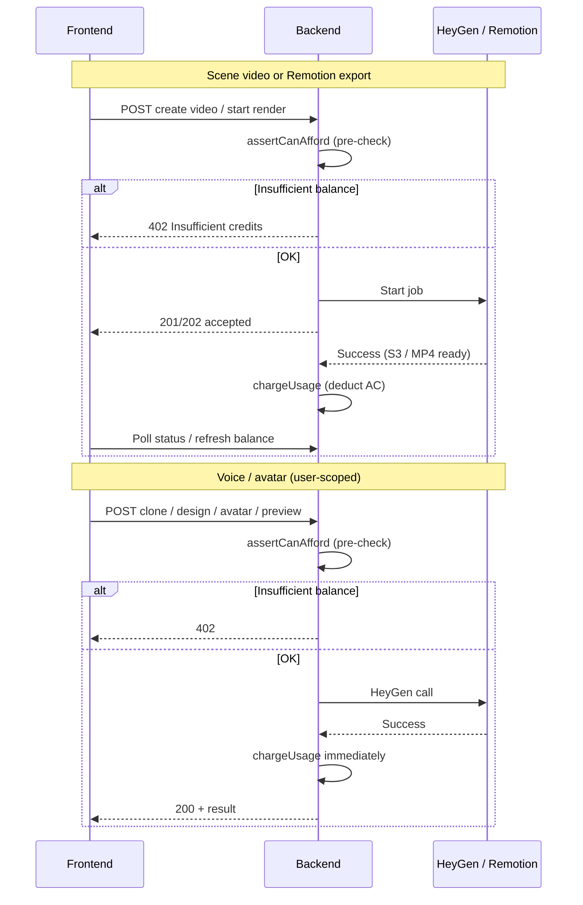
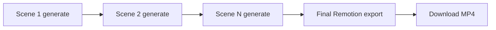

# Credits — Frontend Integration Guide

This guide is for frontend developers integrating **Athena Credits (AC)** into the main Athena VI app: balances, estimates, billing behavior, editor flows, voice/avatar library, and TEAM workspace allocation.

**Canonical HTTP contracts:** [`docs/api/CREDITS_API.md`](api/CREDITS_API.md)  
**Related:** [`PROJECT_EDITOR_INTEGRATION.md`](./PROJECT_EDITOR_INTEGRATION.md) · [`HEYGEN_PROJECT_VIDEOS_API.md`](api/HEYGEN_PROJECT_VIDEOS_API.md) · [`HEYGEN_API.md`](api/HEYGEN_API.md) · [`WORKSPACE_API.md`](api/WORKSPACE_API.md) (renders) · [`SUPERADMIN_FRONTEND_INTEGRATION.md`](./SUPERADMIN_FRONTEND_INTEGRATION.md) (admin grant UI)

---

## Table of contents

1. [Concepts](#1-concepts)
2. [Credit pools & workspace types](#2-credit-pools--workspace-types)
3. [What costs credits](#3-what-costs-credits)
4. [Pricing logic](#4-pricing-logic)
5. [When credits are charged](#5-when-credits-are-charged)
6. [Idempotency & regen behavior](#6-idempotency--regen-behavior)
7. [API reference](#7-api-reference)
8. [Editor integration](#8-editor-integration)
9. [Voice & avatar library](#9-voice--avatar-library)
10. [TEAM workspace allocation](#10-team-workspace-allocation)
11. [History & ledger](#11-history--ledger)
12. [Error handling](#12-error-handling)
13. [Recommended UI patterns](#13-recommended-ui-patterns)
14. [What the frontend must not do](#14-what-the-frontend-must-not-do)
15. [Checklist](#15-checklist)

---

## 1. Concepts

| Term | Meaning |
|------|---------|
| **Athena Credit (AC)** | Platform billing unit. Positive integers only. Shown to users as “credits”. |
| **Personal pool** | `User.credits` — belongs to the logged-in user. |
| **Workspace pool** | `Workspace.credits` — shared TEAM balance (not used for PRIVATE editor billing). |
| **Platform superadmin** | Grants credits via `/api/superadmin/*`. **Not** the same as workspace ADMIN. |
| **Pre-check** | Server verifies balance **before** starting a billable job. Returns **402** if too low. |
| **Charge on success** | Scene HeyGen videos and Remotion exports deduct credits **only after** the job completes successfully. |
| **Charge on completion (sync)** | Voice/avatar HeyGen routes deduct immediately after HeyGen API succeeds. |

**How users get credits today**

- Platform superadmin grants personal credits: `POST /api/superadmin/users/:userId/credits/grant`
- Optional: superadmin grants directly to a TEAM workspace pool
- TEAM owners move personal → workspace via `POST /api/credits/:workspaceId/allocate`
- **No Stripe / no self-serve purchase** in the current backend

New users start with **0** credits unless granted.

---

## 2. Credit pools & workspace types



| Workspace `type` | Scene HeyGen + Remotion billed from | Voice / avatar (`/api/heygen/*`) billed from |
|----------------|-------------------------------------|-----------------------------------------------|
| **PRIVATE** | Acting user's **personal** pool (workspace owner) | Acting user's **personal** pool |
| **TEAM** | **Workspace** pool | Acting user's **personal** pool (always) |

**UI implication**

| Screen | Balance to show |
|--------|-----------------|
| Editor (PRIVATE) | `personalCredits` from `GET /api/credits/:workspaceId` |
| Editor (TEAM) | `workspaceCredits` for generate/export; optionally `personalCredits` in account area |
| Voice / avatar library | `personalCredits` from `GET /api/credits/me` |
| TEAM settings (owner) | Both pools + allocate/deallocate controls |

---

## 3. What costs credits

### Billable features

| Feature | `feature` key (estimates) | API that triggers billing | Pool |
|---------|---------------------------|---------------------------|------|
| Scene avatar video | `heygen_video` | `POST /api/workspaces/:workspaceId/projects/:projectId/heygen/videos` | Workspace-scoped* |
| Scene speech (TTS) | `speech_generation` | `POST /api/workspaces/:workspaceId/projects/:projectId/speech` | Workspace-scoped* |
| Final Remotion export | `remotion_export` | `POST /api/workspaces/:workspaceId/projects/:projectId/renders` | Workspace-scoped* |
| Custom avatar create | `avatar_create` | `POST /api/heygen/avatars` | Personal |
| Voice clone | `voice_clone` | `POST /api/heygen/voices/clone` | Personal |
| Voice design | `voice_design` | `POST /api/heygen/voices` | Personal |
| Speech preview | `voice_preview` | `POST /api/heygen/voices/preview-speech` | Personal |
| Brand kit color suggest | `brand_kit_suggest_colors` | `POST .../brand-kits/suggest/colors` | Workspace-scoped* |
| Brand kit font suggest | `brand_kit_suggest_fonts` | `POST .../brand-kits/suggest/fonts` | Workspace-scoped* |
| Brand kit voice suggest | `brand_kit_suggest_voice` | `POST .../brand-kits/suggest/voice` | Workspace-scoped* |
| Brand kit image style suggest | `brand_kit_suggest_image_style` | `POST .../brand-kits/suggest/image-style` | Workspace-scoped* |
| Brand kit logo variants (apply) | `brand_kit_logo_variants` | `POST .../brand-kits/:id/suggest/logo-variants` with `applyRoles` | Workspace-scoped* |
| Brand kit logo mockup | `brand_kit_logo_mockup` | `POST .../brand-kits/:id/mockups/generate` | Workspace-scoped* (first 2 per kit free) |
| Brand guideline deck | `brand_kit_guideline_generate` | `POST .../brand-kits/:id/guidelines/generate` | Workspace-scoped* |
| AI image (studio) | `image_gen_gpt_image` / `image_gen_gpt_image_hd` | `POST /api/image-gen/workspaces/:workspaceId/generate` | Workspace-scoped* |
| AI infographic surcharge | `image_gen_infographic_surcharge` (rolled into generate total) | same generate, `mode=infographic` | Workspace-scoped* |
| AI social surcharge | `image_gen_social_surcharge` (rolled into generate total) | same generate, `mode=social` | Workspace-scoped* |

\*Workspace-scoped = personal pool if `PRIVATE`, workspace pool if `TEAM`.

**Image Gen:** default infographic (HD + landscape, `modelId` omitted) is **14 AC** (12 + 2). Explicit medium infographic is **8 AC**. Social is model AC + **1** surcharge. A silent quality edit when the first infographic PNG has garbled text/numbering is **included** — it is not a second charge. Social overlay typesetting, hasText wipe, and baked silent edit are also **included** (no extra AC). User-started Tweak / Regenerate still bill. Always call `GET .../image-gen/.../estimate`.

**Brand Kit preview (free):** `POST .../suggest/logo-variants` without `applyRoles` returns base64 previews only — no credit charge. Logo mockups: first **2 successful** generates per brand kit are free.

### Free (no credit charge)

- List avatar groups / looks / voices
- Avatar consent
- Select voice (`POST /api/heygen/voices/select`)
- Project save/load, assets upload (unless future billing added)
- Polling/streaming/download of already-generated HeyGen videos (charge happened at completion)

---

## 4. Pricing logic

The server computes all prices in `src/shared/config/creditPricing.js`. **Do not hard-code AC amounts in the frontend** — always use estimate endpoints.

### Formula

```
athenaCredits = ceil(heygenUsdCost × (1 + marginPercent / 100) × acPerUsd)
```

| Env variable | Typical dev value | Role |
|--------------|-------------------|------|
| `HEYGEN_BILLING_MODE` | `payg` | `payg` or `enterprise` rate tables |
| `ATHENA_MARGIN_PERCENT` | `40` | Platform margin (40% → multiplier 1.4) |
| `ATHENA_AC_PER_USD` | `10000` | AC per USD after margin |
| `HEYGEN_ENTERPRISE_USD_PER_CREDIT` | `0.50` | Enterprise mode only |
| `REMOTION_USD_PER_OUTPUT_SEC` | `0.01` | Final export per second of output |
| `CREDIT_ESTIMATE_WORDS_PER_MINUTE` | `150` | Script → duration estimate |

### PAYG reference rates (HeyGen self-serve, 720p/1080p)

Rates follow [HeyGen self-serve pricing](https://developers.heygen.com/docs/pricing). Scene video cost depends on **`avatarType`**, not engine (IV vs V same table).

| `avatarType` | USD/sec |
|--------------|---------|
| `photo_avatar` | $0.05 |
| `studio_avatar`, `digital_twin` | $0.0667 |
| (omitted — conservative default) | $0.0667 |

| Feature | Basis |
|---------|--------|
| `heygen_video` | `avatarType` × output seconds (720p/1080p) |
| `remotion_export` | `REMOTION_USD_PER_OUTPUT_SEC` per second |
| `avatar_create` | Flat $1 |
| `voice_clone` | Flat $2 (Athena estimate; not in HeyGen public table) |
| `voice_design` | Flat $1 (Athena estimate) |
| `voice_preview` | $0.000667/sec (TTS Starfish) |
| `speech_generation` | Same TTS Starfish rate as `voice_preview`; workspace-scoped |

### Enterprise mode (`HEYGEN_BILLING_MODE=enterprise`)

| Engine | HeyGen credits/sec |
|--------|-------------------|
| `avatar_iv`, `avatar_v` | 0.1 |
| `avatar_iii` (legacy) | 0.0033 |

Converted to USD via `HEYGEN_ENTERPRISE_USD_PER_CREDIT`, then Athena margin + AC scale.

### Example costs (PAYG, 40% margin, 10,000 AC/USD)

These are **illustrative** — call estimate APIs with `avatarType` for live numbers.

| Action | Approximate AC |
|--------|----------------|
| 30s scene video (`photo_avatar`) | ~21,000 |
| 30s scene video (`studio_avatar`) | ~28,000 |
| 5 min Remotion export | ~42,000 |
| Avatar create | ~14,000 |
| Voice clone | ~28,000 |
| Voice design | ~14,000 |

### Duration used for billing

| Feature | Duration source |
|---------|-----------------|
| Scene HeyGen | HeyGen-reported duration when available; else estimated from script word count (min 5s) |
| Remotion export | `durationInFrames / fps` from final stitched output |
| Voice preview | Estimated from preview `text` length |

### Brand Kit (flat AC)

Flat workspace-scoped charges from `src/shared/config/brandKitCreditPricing.js`. **Do not hard-code** — read defaults from server config or show fixed labels until an estimate API is added.

| `feature` key | Default AC | Charged when |
|---------------|------------|--------------|
| `brand_kit_suggest_colors` | 2 | Valid palette returned |
| `brand_kit_suggest_fonts` | 1 | Valid fonts returned |
| `brand_kit_suggest_voice` | 1 | Valid voice returned |
| `brand_kit_suggest_image_style` | 1 | Valid image brief returned |
| `brand_kit_logo_variants` | 2 | Only when `applyRoles` commits variants |
| `brand_kit_logo_mockup` | 4 | After success; first 2 per brand kit free |
| `brand_kit_guideline_generate` | 3 | Guideline deck created or regenerated |

Env overrides: `BRAND_KIT_*_AC` (see [`ENVIRONMENT.md`](api/ENVIRONMENT.md)). Full API: [`BRAND_KIT_API.md`](api/BRAND_KIT_API.md).

---

## 5. When credits are charged



| Flow | Pre-check (402 at request) | Actual deduction |
|------|----------------------------|------------------|
| Scene HeyGen video | Yes — at `POST .../heygen/videos` | When MP4 is uploaded to S3 (`billingStatus: charged`) |
| Remotion export | Yes — at `POST .../renders` | When render `status: completed` |
| Voice clone / design / avatar / preview | Yes — before HeyGen call | Immediately after HeyGen succeeds |
| Brand Kit suggest / guideline | Yes — `assertAfford` before AI/sharp work | After successful response (logo variants only when variants applied) |

**Failed jobs are not charged.** HeyGen video failure sets `billingStatus: failed`. Remotion failure sets `billingStatus: failed`. Brand Kit suggest calls that fail validation or AI errors are not charged.

**Edge case:** Pre-check uses an **estimate**. Final charge uses **actual** duration when available (may differ slightly from estimate). Always refresh balance after completion.

---

## 6. Idempotency & regen behavior

### Scene HeyGen — two layers

**1. Request hash (no duplicate job)**

Same inputs → same existing `heygenVideo` row returned (no new HeyGen API call):

- `workspaceId`, `projectId`, `sceneId`, `avatarId`, `voiceId`, `script` (normalized), `avatarEngine`

If the user clicks “Generate” again with **unchanged** script/voice/avatar/engine → **201 with existing row** → **no new charge** (billing idempotency key is per `heygenVideo.id`).

**2. Billing idempotency key**

```
heygen-video:{heygenVideoId}
```

At most **one** usage transaction per stored HeyGen response row.

**Regen that costs again:** change script, voice, avatar, or `avatarEngine` → new request hash → new row → new charge when that video completes.

### Remotion export

```
project-render:{renderId}
```

Each export creates a new `renderId` → new charge on success. `forceRebuild: true` on an existing render flow still bills per render row.

### User HeyGen (voice / avatar)

| Action | Idempotency key pattern |
|--------|-------------------------|
| Avatar create | `heygen-avatar:{groupId}` |
| Voice design | `heygen-voice-design:{userId}:{voiceId}` |
| Voice clone | `heygen-voice-clone:{voiceId}` |
| Voice preview | `heygen-voice-preview:{userId}:{voiceId}:{timestamp}` (each preview is unique) |

### Brand Kit (flat features)

| Action | Idempotency key pattern | Notes |
|--------|-------------------------|-------|
| Suggest colors/fonts/voice/image-style | `brandKit:{action}:{workspaceId}:{payloadHash}` | Same body → same hash → no double charge on retry |
| Logo variants (apply) | `brandKit:logo_variants:{workspaceId}:{rolesHash}` | Preview without `applyRoles` is free |
| Logo mockup | `brandKit:logo_mockup:{workspaceId}:{brandKitId}:{templateId}:{timestamp}` | First 2 per kit free |
| Guideline generate | `brandKit:guideline:{workspaceId}:{brandKitId}:{timestamp}` | Each regenerate is a new charge |

---

## 7. API reference

Base path: **`/api/credits`**  
Auth: **`Authorization: Bearer <accessToken>`** on all routes.

Full field-level contracts: [`docs/api/CREDITS_API.md`](api/CREDITS_API.md)

### 7.1 Personal balance

```http
GET /api/credits/me
Authorization: Bearer <accessToken>
```

**200** — `data`:

```json
{
  "personalCredits": 50000
}
```

Use on: global header, voice/avatar screens, PRIVATE editor.

### 7.2 Workspace balance

```http
GET /api/credits/:workspaceId
Authorization: Bearer <accessToken>
```

Requires workspace member (OWNER, ADMIN, or MEMBER).

**200** — `data`:

```json
{
  "workspaceId": "uuid",
  "personalCredits": 50000,
  "workspaceCredits": 120000,
  "workspaceType": "TEAM"
}
```

For `PRIVATE`, `workspaceCredits` may be `0` or unused — editor billing uses `personalCredits`.

### 7.3 Personal estimate

```http
GET /api/credits/me/estimate?feature=voice_clone
GET /api/credits/me/estimate?feature=voice_preview&text=Hello%20world
```

| Query `feature` | Required extra |
|-----------------|----------------|
| `voice_clone` | — |
| `voice_design` | — |
| `avatar_create` | — |
| `voice_preview` | optional `text` (better estimate) |

**200** — `data`:

```json
{
  "estimatedCredits": 28000,
  "breakdown": {
    "feature": "voice_clone",
    "durationSeconds": 0,
    "billingMode": "payg",
    "marginPercent": 40,
    "acPerUsd": 10000
  }
}
```

### 7.4 Workspace estimate

```http
GET /api/credits/:workspaceId/estimate?feature=heygen_video&avatarEngine=avatar_iv&avatarType=photo_avatar&resolution=1080p&script=Your%20script%20here

GET /api/credits/:workspaceId/estimate?feature=remotion_export&durationInFrames=9000&fps=30
```

| Query `feature` | Parameters |
|-----------------|------------|
| `heygen_video` | `avatarEngine` (`avatar_iv` \| `avatar_v`), optional `avatarType` (`photo_avatar` \| `studio_avatar` \| `digital_twin`), optional `resolution` (`720p` \| `1080p`), optional `script` |
| `speech_generation` | optional `script` (better estimate) |
| `remotion_export` | optional `durationInFrames`, `fps` (default fps 30) |

### 7.5 Allocate / deallocate (TEAM owner only)

```http
POST /api/credits/:workspaceId/allocate
Content-Type: application/json

{ "amount": 10000 }
```

```http
POST /api/credits/:workspaceId/deallocate
Content-Type: application/json

{ "amount": 5000 }
```

Moves AC personal ↔ workspace. **OWNER only.** **TEAM workspaces only.**

**402** if insufficient balance on source pool.

**200** — returns updated balance view (same shape as `GET /api/credits/:workspaceId`).

### 7.6 History endpoints

| Endpoint | Who | What it shows |
|----------|-----|---------------|
| `GET /api/credits/me/history?page=1&limit=20` | Any user | Personal-scope ledger |
| `GET /api/credits/:workspaceId/history` | OWNER, ADMIN | All workspace-scoped transactions |
| `GET /api/credits/:workspaceId/my-history` | Any member | Current user's usage in that workspace |
| `GET /api/credits/:workspaceId/usage-by-member?page=&limit=` | OWNER, ADMIN | TEAM only — aggregate per member + pagination |

### Transaction `type` values

| `type` | Meaning |
|--------|---------|
| `usage` | Spent on HeyGen, render, etc. (`amount` negative) |
| `platform_grant` | Superadmin added credits |
| `platform_revoke` | Superadmin removed credits |
| `allocation` | Owner moved credits to/from workspace |
| `deallocation` | Owner moved credits back to personal |
| `refund` | Reserved for future use |

Each transaction includes **`usageDetail`** for UI display (server-enriched):

```json
{
  "id": "uuid",
  "amount": -28000,
  "type": "usage",
  "usageDetail": {
    "consumptionType": "Avatar video",
    "label": "Avatar video scene “Intro” in “Q1 Training”",
    "displayName": "Avatar video scene “Intro” in “Q1 Training”",
    "where": "Scene: Intro · Project: Q1 Training · Workspace: Acme Team",
    "feature": "heygen_video",
    "kind": "heygen_video",
    "credits": 28000,
    "projectName": "Q1 Training",
    "sceneName": "Intro",
    "sceneId": "scene-intro",
    "videoTitle": "Welcome clip",
    "scriptPreview": "Hello and welcome to…",
    "avatarEngine": "avatar_iv",
    "durationSeconds": 30,
    "workspaceName": "Acme Team"
  }
}
```

**Remotion export example:** `displayName`: `Video export — “Q1 Training”` · `videoName` = project name · `where`: `Project: Q1 Training · Workspace: …`

**Avatar scene example:** `displayName`: `Avatar video scene “Intro” in “Q1 Training”` — always says **Avatar video** plus **where** (scene + project). `sceneName` / `projectName` are also separate fields.

**Personal voice/avatar example:** `label: "Voice clone"`, `voiceName`, or `avatarName`.

**UI:** Show **`usageDetail.displayName`** (or `label` — same value) as the main line. Optional subtitle: **`usageDetail.where`**. Do not show only `sceneName` without “Avatar video” context.

---

## 8. Editor integration

See also [`PROJECT_EDITOR_INTEGRATION.md`](./PROJECT_EDITOR_INTEGRATION.md) and [`HEYGEN_PROJECT_VIDEOS_API.md`](api/HEYGEN_PROJECT_VIDEOS_API.md).

### 8.1 On editor / workspace load

1. `GET /api/credits/:workspaceId` — show balance chip.
2. If `workspaceType === 'TEAM'`, label clearly: “Workspace credits” vs “Personal credits”.

### 8.2 Per-scene HeyGen generate

**Before generate**

```http
GET /api/credits/:workspaceId/estimate?feature=heygen_video&avatarEngine=avatar_iv&avatarType=photo_avatar&resolution=1080p&script=<scene script>
```

Show `estimatedCredits` in confirm UI or scene panel.

**Generate**

```http
POST /api/workspaces/:workspaceId/projects/:projectId/heygen/videos
```

- **402** → block; show insufficient credits modal.
- **201** → persist `data.heygenVideo.id` as `heygenVideoId` in scene state.

**After completion**

Poll `GET .../heygen/videos/:heygenVideoId` until `status === 'completed'`. Then refresh balance.

Billing fields on `heygenVideo` (when charged):

| Field | Meaning |
|-------|---------|
| `billingStatus` | `pending` \| `charged` \| `failed` \| `skipped` |
| `creditsCharged` | AC deducted (null until charged) |
| `billedDurationSec` | Seconds used for pricing |
| `billingContext.estimatedCredits` | Pre-check estimate stored at create time |

**UX:** Do not deduct locally on 201 — wait for `billingStatus: charged` or refresh balance after `completed`.

### 8.3 Final Remotion export

**Before export**

```http
GET /api/credits/:workspaceId/estimate?feature=remotion_export&durationInFrames=<total>&fps=<fps>
```

Derive `durationInFrames` from editor timeline (sum of scene durations).

**Start export**

```http
POST /api/workspaces/:workspaceId/projects/:projectId/renders
```

Optional body: `{ "forceRebuild": false }`.

- **402** at start if estimate exceeds balance.
- **202** — poll `GET .../renders/:renderId` until `completed` or `failed`.

On `completed`, read `creditsCharged` from render row and refresh workspace balance.

### 8.4 Typical project cost model

```
Total ≈ Σ (each scene that needs new HeyGen generation)
      + 1 × final Remotion export
      + optional personal-pool voice/avatar ops (outside editor)
```

Use estimate APIs per scene + one export estimate for a “project total” preview in UI.



Identical scene regen (unchanged hash) skips new HeyGen job and new charge.

---

## 9. Voice & avatar library

Base path: **`/api/heygen`** — see [`HEYGEN_API.md`](api/HEYGEN_API.md).

All billable routes use **personal** pool only. **Workspace sharing** does not change billing — it only lets teammates use your shared avatar/voice in TEAM scene videos (workspace pool).

| Flow | Steps |
|------|--------|
| Clone voice | `GET /api/credits/me` → estimate `voice_clone` → `POST /api/heygen/voices/clone` |
| Design voice | estimate `voice_design` → `POST /api/heygen/voices` |
| Create avatar | estimate `avatar_create` → `POST /api/heygen/avatars` |
| Preview speech | estimate `voice_preview&text=...` → `POST /api/heygen/voices/preview-speech` |

**402** before HeyGen is called — safe to show cost in confirm dialog.

After success, refresh `GET /api/credits/me`.

---

## 10. TEAM workspace allocation

Only **workspace OWNER** can move credits between personal and TEAM workspace pool.

**Suggested owner settings UI**

1. Show `personalCredits` and `workspaceCredits`.
2. Allocate form → `POST .../allocate` — “Move X credits to team workspace”.
3. Deallocate form → `POST .../deallocate` — “Return X credits to my personal balance”.
4. **402** if source pool too low.

Members consume **workspace** credits when generating scene videos or exporting in that TEAM workspace. They still need **personal** credits for voice/avatar library actions.

Superadmin can also grant directly to workspace pool — see [`SUPERADMIN_FRONTEND_INTEGRATION.md`](./SUPERADMIN_FRONTEND_INTEGRATION.md).

---

## 11. History & ledger

Use history endpoints for:

- Account → “Credit history” (`/api/credits/me/history`)
- Workspace admin → team usage (`/api/credits/:id/history`, `/usage-by-member`)
- Member → “My usage in this workspace” (`/my-history`)

Display:

- `amount` — positive = credit in, negative = usage out
- `type` — see table in §7.6
- `createdAt`
- `metadata.feature` when present (e.g. `heygen_video`, `remotion_export`, `ppt_*`, `image_gen_*`, `brand_kit_*`)
- Prefer **`usageDetail.label`** / **`usageDetail.displayName`** when present (server maps features to readable names, including presentation and image-gen)

---

## 12. Error handling

Standard error envelope:

```json
{
  "success": false,
  "message": "Insufficient credits",
  "errors": []
}
```

| Status | When | Frontend action |
|--------|------|-----------------|
| **402** | `INSUFFICIENT_CREDITS` | Block action; show balance; link to support / admin |
| **403** | Wrong workspace role | Normal forbidden UX |
| **400** | Validation | Show `message` / `errors` |
| **401** | Expired token | Refresh or redirect to login |

**Suggested global interceptor** for billable routes:

```javascript
async function apiFetch(url, options) {
  const res = await fetch(url, {
    ...options,
    credentials: 'include',
    headers: {
      'Content-Type': 'application/json',
      Authorization: `Bearer ${getAccessToken()}`,
      ...options.headers,
    },
  });
  const body = await res.json();
  if (!body.success) {
    if (res.status === 402) {
      // Refresh balances and show credits modal
      await refreshCreditBalances();
      throw new CreditError(body.message);
    }
    if (res.status === 401) await refreshOrRedirectLogin();
    throw new Error(body.message || 'Request failed');
  }
  return body.data;
}
```

Billable routes that may return **402**:

- `POST .../heygen/videos`
- `POST .../renders`
- `POST /api/heygen/avatars`
- `POST /api/heygen/voices`
- `POST /api/heygen/voices/clone`
- `POST /api/heygen/voices/preview-speech`
- `POST /api/credits/:id/allocate` / `deallocate`
- `POST .../brand-kits/suggest/colors|fonts|voice|image-style`
- `POST .../brand-kits/:brandKitId/suggest/logo-variants` (when applying with `applyRoles`)
- `POST .../brand-kits/:brandKitId/mockups/generate` (after first 2 free per kit)
- `POST .../brand-kits/:brandKitId/guidelines/generate`

---

## 13. Recommended UI patterns

| Location | Pattern |
|----------|---------|
| App shell | Personal balance badge from `GET /api/credits/me` |
| Editor toolbar | Workspace-relevant balance from `GET /api/credits/:workspaceId` |
| Generate scene button | Show estimate; disable or warn if estimate > available pool |
| Export button | Show export estimate from timeline duration |
| Confirm modals | “This will use ~X AC” from estimate API |
| After async completion | Refresh balance when HeyGen `completed` or render `completed` |
| 402 modal | “Insufficient credits — contact your administrator” (no purchase CTA yet) |
| TEAM owner settings | Allocate / deallocate + both pool balances |
| History page | Paginated ledger with type labels |

**Balance refresh triggers**

- App load / workspace enter
- After voice/avatar POST success
- After HeyGen video reaches `completed` + `billingStatus: charged`
- After render `completed`
- After allocate/deallocate
- On 402 error

---

## 14. What the frontend must not do

- **Do not** hard-code AC prices — use estimate endpoints.
- **Do not** deduct credits optimistically on the client — server is source of truth.
- **Do not** assume new users have credits — default is 0 until superadmin grant.
- **Do not** treat workspace **ADMIN** as platform superadmin.
- **Do not** read credit role from JWT — use `GET /api/credits/*` and `GET /api/user/capabilities` (admin only).
- **Do not** implement Stripe checkout — not in backend yet.
- **Do not** show workspace pool as spendable for voice/avatar — those always use personal pool.

---

## 15. Checklist

### Balances & estimates

- [ ] `GET /api/credits/me` on app load
- [ ] `GET /api/credits/:workspaceId` when entering a workspace / editor
- [ ] Estimate calls before generate, export, voice/avatar actions
- [ ] Correct pool displayed for PRIVATE vs TEAM vs voice library

### Editor

- [ ] Handle **402** on `POST .../heygen/videos` and `POST .../renders`
- [ ] Refresh balance after HeyGen `completed` (not only on 201)
- [ ] Refresh balance after render `completed`
- [ ] Optional: show `creditsCharged` from `heygenVideo` / render row

### Voice / avatar

- [ ] Personal balance on library screens
- [ ] Confirm dialog with estimate before billable POSTs
- [ ] Handle **402** on clone / design / avatar / preview

### TEAM

- [ ] Owner-only allocate / deallocate UI
- [ ] **402** on insufficient personal or workspace balance

### Errors

- [ ] Global or per-route **402** handler with balance refresh
- [ ] No client-side price math for billing

### Brand Kit (Virtual Studio)

- [ ] Show flat AC cost before suggest / guideline / mockup actions (from config or product copy)
- [ ] Handle **402** / **429** on Brand Kit billable POSTs
- [ ] Logo variant preview (no `applyRoles`) — no credit check required
- [ ] Logo mockups: show freeRemaining; first 2 free then 4 AC
- [ ] Refresh balance after suggest / guideline / mockup success

### Admin (if building portal)

- [ ] See [`SUPERADMIN_FRONTEND_INTEGRATION.md`](./SUPERADMIN_FRONTEND_INTEGRATION.md)

---

**Questions?** API contracts: [`docs/api/CREDITS_API.md`](api/CREDITS_API.md) · Admin grants: [`docs/SUPERADMIN_FRONTEND_INTEGRATION.md`](./SUPERADMIN_FRONTEND_INTEGRATION.md)
