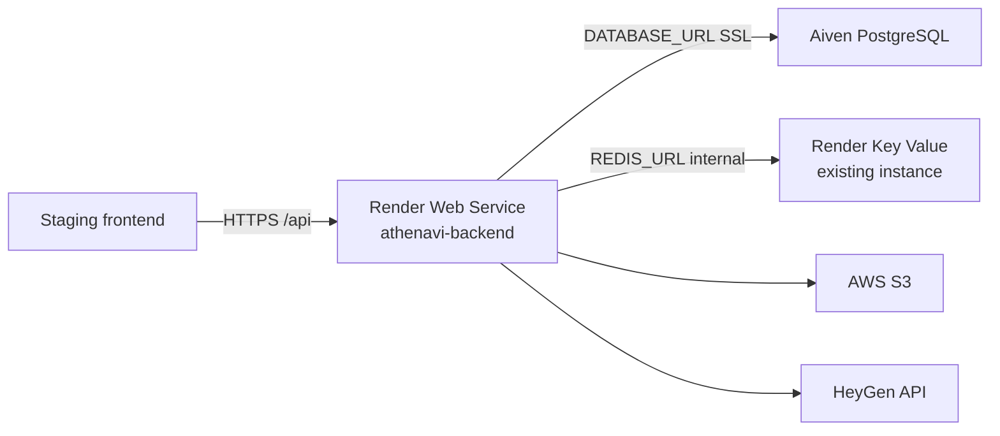

# Deploy Athena VI backend on Render (testing)

Staging deployment on [Render](https://render.com) using:

- **PostgreSQL** — existing **Aiven** database (same as local `DATABASE_URL`)
- **Redis** — existing **Render Key Value** instance (same account, Oregon)
- **Web service** — this repo (`render.yaml` creates only the web service)

Migrations run on every deploy at **startup** (free tier does not support pre-deploy commands):

`npx prisma migrate deploy && npm start`

---

## Free tier — why Render asks for a card

The blueprint uses **`plan: free`** for the web service. You should **not** need a card for that alone.

If Render still asks for payment details, check:

| Cause | What to do |
|-------|------------|
| **Starter / Standard selected** | Change **Instance type** to **Free** (Blueprint → edit service, or manual create flow) |
| **Paid workspace** | Use **Hobby** workspace, not Professional / Organization |
| **Existing Redis is paid** | Your Key Value instance may already be on a paid plan — that is separate; the web service can still be Free |
| **Upgrading during signup** | Skip any “upgrade” prompts; pick Free explicitly |

**Free web service limits:** spins down after ~15 min idle, ~30–60 s cold start on wake-up, 512 MB RAM. Fine for API testing; not ideal for always-on demos.

---

## What you do in Render (checklist)

### 1. Push code

Commit and push `render.yaml` (and the rest of the repo) to GitHub/GitLab/Bitbucket.

### 2. Create the web service

**Option A — Blueprint (if repo has `render.yaml`)**

1. [dashboard.render.com](https://dashboard.render.com) → **New +** → **Blueprint**
2. Connect the **AthenaVI_backend** repository
3. Render shows **one** resource: `athenavi-backend` (web service)
4. Click **Apply** — Render will prompt for secret env vars marked `sync: false`

**Option B — Manual web service**

1. **New +** → **Web Service** → connect repo
2. Name: `athenavi-backend`
3. Region: **Oregon** (same as your Redis)
4. Branch: your deploy branch (e.g. `main`)
5. Runtime: **Node**
6. Build command: `npm install --production=false && npx prisma generate`
7. Start command: `npx prisma migrate deploy && npm start`
8. Instance type: **Free** (no card required for the web service; spins down after ~15 min idle)

### 3. Set environment variables

Open the web service → **Environment** → add variables below.

Copy values from your local `.env.development` unless noted.

#### Required (app will not start without these)

| Variable | Where to get it |
|----------|-----------------|
| `DATABASE_URL` | Aiven console → your Postgres service → **Connection information** → URI with `?sslmode=require` |
| `REDIS_URL` | Render → your **Key Value** instance → **Connect** → **Internal Redis URL** only (not External) |
| `JWT_SECRET` | Same as local, or generate a new long random string for staging |
| `BACKEND_URL` | Set **after** first deploy: `https://<service-name>.onrender.com` (no trailing slash) |
| `FRONTEND_URL` | Your staging frontend URL (e.g. Vercel/Netlify preview) |
| `CORS_ORIGINS` | Same as `FRONTEND_URL` (comma-separated if multiple origins) |

#### AWS (assets, uploads)

| Variable | |
|----------|--|
| `AWS_ACCESS_KEY_ID` | From `.env.development` |
| `AWS_SECRET_ACCESS_KEY` | From `.env.development` |
| `AWS_REGION` | e.g. `us-east-1` |
| `AWS_S3_BUCKET` | e.g. `virtual-instructor` |

#### Auth & email

| Variable | |
|----------|--|
| `GOOGLE_CLIENT_ID` | Google Cloud Console |
| `GOOGLE_CLIENT_SECRET` | Google Cloud Console |
| `SMTP_HOST` | e.g. `smtp.gmail.com` |
| `SMTP_PORT` | `587` |
| `SMTP_USER` | |
| `SMTP_PASS` | |

#### Integrations (optional but recommended for full testing)

| Variable | |
|----------|--|
| `HEYGEN_API_KEY` | |
| `PLATFORM_SUPERADMIN_EMAILS` | Comma-separated emails |
| `PEXELS_API_KEY` | Stock media |
| `UNSPLASH_ACCESS_KEY` | Stock media |
| `PIXABAY_API_KEY` | Stock media |

#### Already set by `render.yaml` (no action needed if using Blueprint)

`NODE_ENV=production`, `SALT_ROUNDS=10`, `TRUST_PROXY_HOPS=1`, `JSON_BODY_LIMIT=32mb`, `HEYGEN_BILLING_MODE=payg`

Click **Save Changes** — Render redeploys automatically.

### 4. Allow Render to reach Aiven Postgres

Aiven blocks unknown IPs by default.

1. Aiven console → your Postgres service → **Integrations** or **Network / IP filter**
2. For a quick test: allow **`0.0.0.0/0`** (or add Render’s outbound IPs if you use static egress)
3. Without this, deploy logs show database connection timeouts

Your app already uses SSL to Aiven (`sslmode=require` in `DATABASE_URL`).

### 5. Redis URL — must be internal

Your Key Value instance blocks **external** clients unless their IP is on the allowlist.  
If logs show `Client IP address is not in the allowlist`, you pasted the **External** URL.

1. Open the Key Value service → **Connect**
2. Copy **Internal Redis URL** (hostname is `red-…`, not `…keyvalue.render.com`)
3. Set that as `REDIS_URL` on the web service
4. Web service region must be **Oregon** (same as the Key Value instance)

Do **not** copy the External URL from `.env.development` — that works from your laptop, not from another Render service without allowlisting.

### 6. Google OAuth redirect

In [Google Cloud Console](https://console.cloud.google.com/) → APIs & Services → Credentials → your OAuth client:

Add **Authorized redirect URI**:

```text
https://<your-render-host>/api/auth/google/callback
```

Example: `https://athenavi-backend.onrender.com/api/auth/google/callback`

Update `BACKEND_URL` to match that host.

### 7. Verify deploy

1. **Logs** tab — look for:
   - `prisma migrate deploy` success (at startup, before server listens)
   - `Database connected and verified`
   - `Redis connected`
   - `Server running on port ...`
2. Browser or curl:

```bash
curl https://<your-render-host>/
# → Virtual Instructor Backend Running
```

API base: `https://<your-render-host>/api`

Point your staging frontend at that base URL (`REACT_APP_API_URL` / `VITE_API_URL` etc.).

---

## Architecture



---

## Troubleshooting

| Symptom | Fix |
|---------|-----|
| Pre-deploy / startup: `Can't reach database` | Aiven IP allowlist; check `DATABASE_URL` and `sslmode=require` |
| `Redis error` / `not in the allowlist` | `REDIS_URL` must be **Internal Redis URL**, not External |
| `self-signed certificate in certificate chain` (Postgres) | Fixed in code for Aiven; redeploy after pull. Keep `?sslmode=require` in `DATABASE_URL` — app strips it for the runtime client |
| CORS errors from browser | Set `FRONTEND_URL` or `CORS_ORIGINS` to exact frontend origin (no trailing slash) |
| Google login redirect fails | `BACKEND_URL` + Google redirect URI must match Render URL |
| Cookies / refresh not working | Frontend must use `credentials: 'include'`; API origin must be in CORS list |
| Remotion render fails | Normal on small instances — needs more RAM/CPU; API otherwise works |

---

## Remotion note

Server-side Remotion renders need Chrome and significant memory. On the Free plan (512 MB), most API routes work; render endpoints will likely timeout.

---

## Local env reference

[`.env.example`](../.env.example) · [`docs/api/ENVIRONMENT.md`](api/ENVIRONMENT.md)
