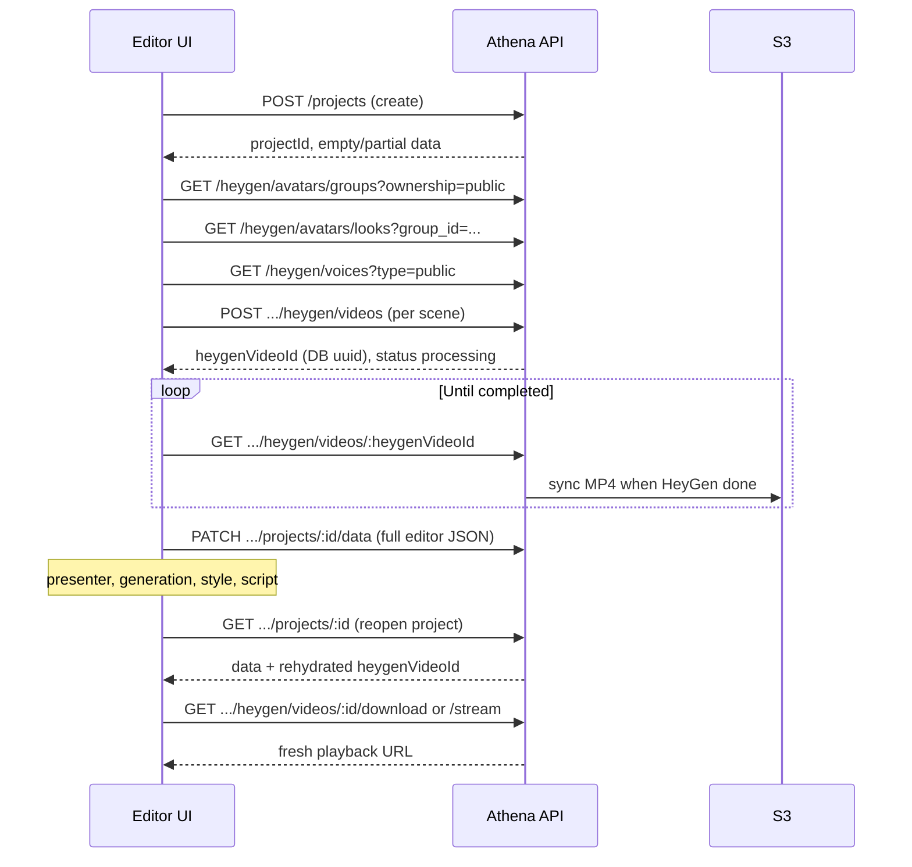

# Project & Editor API — Frontend Integration Guide

This guide is for the **scene-based video editor** (React/Vite). It explains how to integrate with Athena VI backend project APIs, HeyGen avatar clips, save/load round-trips, and common pitfalls seen in production.

**Canonical HTTP contracts** (every path, status code, field): [`docs/api/README.md`](api/README.md) · [Workspace / projects](api/WORKSPACE_API.md) · [HeyGen project videos](api/HEYGEN_PROJECT_VIDEOS_API.md) · [Credits (billing UX)](./CREDITS_FRONTEND_INTEGRATION.md)  
**Postman examples**: [`postman/AthenaVI_Backend.postman_collection.json`](../postman/AthenaVI_Backend.postman_collection.json)

---

## Table of contents

1. [Prerequisites](#1-prerequisites)
2. [Auth & base URL](#2-auth--base-url)
3. [Recommended integration flow](#3-recommended-integration-flow)
4. [Project API endpoints](#4-project-api-endpoints)
5. [Editor payload (`project.data`)](#5-editor-payload-projectdata)
6. [HeyGen avatar video flow](#6-heygen-avatar-video-flow)
7. [Save & load round-trip](#7-save--load-round-trip)
8. [Playback (avoid blob URL bugs)](#8-playback-avoid-blob-url-bugs)
9. [Assets (images, audio, video)](#9-assets-images-audio-video)
10. [Final render (optional)](#10-final-render-optional)
11. [Server-side rehydration](#11-server-side-rehydration)
12. [Common errors & fixes](#12-common-errors--fixes)
13. [Checklists](#13-checklists)

---

## 1. Prerequisites

| Requirement | Why |
|-------------|-----|
| **Bearer access token** on all project routes | `Authorization: Bearer <accessToken>` |
| **Workspace membership** (OWNER, ADMIN, or MEMBER) | Nested under `/api/workspaces/:workspaceId/...` |
| **`HEYGEN_API_KEY`** on server | Avatar video create / poll |
| **AWS S3 env on server** | Upload HeyGen MP4s; `/download` and `/stream` |
| **Stable `sceneId` per scene** | HeyGen idempotency, S3 path, rehydration |

Default local API: `http://localhost:9000` (see `PORT` in `.env`).

---

## 2. Auth & base URL

```http
Authorization: Bearer <accessToken>
Content-Type: application/json
```

Obtain token via `POST /api/auth/login` or `POST /api/auth/register`. Refresh uses httpOnly cookie: `POST /api/auth/refresh`.

All project routes:

```text
/api/workspaces/:workspaceId/projects/...
```

---

## 3. Recommended integration flow



---

## 4. Project API endpoints

| Action | Method | Path |
|--------|--------|------|
| Create project | `POST` | `/api/workspaces/:workspaceId/projects` |
| List projects | `GET` | `/api/workspaces/:workspaceId/projects?folderId=` |
| Get project (editor load) | `GET` | `/api/workspaces/:workspaceId/projects/:projectId` |
| Update metadata | `PATCH` | `/api/workspaces/:workspaceId/projects/:projectId` |
| **Save editor state** | `PATCH` | `/api/workspaces/:workspaceId/projects/:projectId/data` |
| Move folder | `PATCH` | `/api/workspaces/:workspaceId/projects/:projectId/move-folder` |
| Delete project | `DELETE` | `/api/workspaces/:workspaceId/projects/:projectId` |

### Create project (wizard)

```json
POST /api/workspaces/:workspaceId/projects

{
  "title": "Untitled Video",
  "folderId": "folder-uuid",
  "aspectRatio": "16:9",
  "tags": ["Presentation"]
}
```

Response `201`: `data.project.id` → store as **`projectId`**.

Optional: send initial `data` or `projectState` with `videoSettings` and `scenes: []`.

### Update metadata only

Does **not** update scenes. Use for rename, thumbnail, status:

```json
PATCH /api/workspaces/:workspaceId/projects/:projectId

{
  "name": "Renamed title",
  "thumbnail": "https://example.com/preview.png",
  "status": "draft"
}
```

### Save editor state (critical)

```json
PATCH /api/workspaces/:workspaceId/projects/:projectId/data

{
  "data": { "videoSettings": { ... }, "scenes": [ ... ] }
}
```

Response `200`: `data.project` with updated `data`, `duration`, `updatedAt`.

---

## 5. Editor payload (`project.data`)

The backend stores the full editor JSON in `project.data`. **Send everything the editor needs on reload** — do not strip to `{ content: { src } }` only.

### Top level

```json
{
  "videoSettings": {
    "width": 1920,
    "height": 1080,
    "fps": 30,
    "backgroundColor": "#000000"
  },
  "scenes": [ ],
  "meta": {
    "aspectRatio": "16:9",
    "tags": ["Demo"]
  }
}
```

### Scene

| Field | Required | Notes |
|-------|----------|--------|
| `sceneId` | Yes | Stable string; never change after first save |
| `durationInFrames` | Yes | At project fps |
| `background` | Yes | `{ type: "color", value: "#..." }` or asset ref |
| `elements` | Yes | Array (alias: `clips` accepted, normalized to `elements`) |
| `name` | No | Display name |
| `order`, `locked`, `layout` | No | Persisted |
| `presenter` | No | HeyGen config (see below) |
| `generation` | No | HeyGen job link (see below) |
| `transition` | No | `{ in, out }` **or** flat `{ type, durationInFrames, direction }` |

### Scene-level HeyGen (recommended)

```json
"presenter": {
  "avatarId": "lk_xxxxx",
  "avatarName": "Sarah - Business",
  "avatarType": "studio_avatar",
  "avatarPreviewSrc": "https://...",
  "voiceId": "voice_xxxxx",
  "voiceName": "Jenny",
  "voiceSettings": { "speed": 1, "pitch": 0 },
  "script": "Welcome to our product demo..."
},
"generation": {
  "status": "completed",
  "heygenVideoId": "00000000-0000-4000-8000-000000000012"
}
```

- **`heygenVideoId`** = `data.heygenVideo.id` from `POST .../heygen/videos` (backend UUID, **not** HeyGen’s `videoId`).
- Do **not** rely on **`generatedVideoUrl`** after reload — refetch via `/download` or `/stream`.

### Audio-only scene speech (no avatar)

For narration without a talking-head video, use **`POST .../speech`** ([PROJECT_SPEECH_API.md](api/PROJECT_SPEECH_API.md)).

```json
"presenter": {
  "voiceId": "voice_xxxxx",
  "script": "Welcome to our audio lesson..."
},
"generation": {
  "status": "completed",
  "speechGenerationId": "00000000-0000-4000-8000-000000000013"
}
```

- **`speechGenerationId`** = `data.speechGeneration.id` from `POST .../speech`.
- Playback: `GET .../speech/:speechId/stream` or `/download` (same patterns as HeyGen video).
- Optional: add an `audio` element with `content.speechGenerationId` for timeline placement.

### Element (clip)

| Field | Required | Notes |
|-------|----------|--------|
| `id`, `type`, `layer` | Yes | `type`: `text` \| `image` \| `icon` \| `video` \| `avatar` \| `shape` \| `audio` \| `subtitle` |
| `shapeKey` | No | Library preset id for shapes/frames (`frame-diamond`, `arrow-right`, …) |
| `startFrame`, `durationInFrames` | Yes* | *Or nested `timing: { startFrame, durationInFrames }` |
| `placement` | Yes | `x`, `y`, `width`, `height`; optional `rotation`, `scale`, `opacity` |
| `content` | Yes | Type-specific (text string, asset ref, etc.) |
| `style`, `filters` | No | **Persisted** — font, objectFit, flip, borders, CSS filters |
| `role`, `visible`, `editable`, `isBackground`, `audio` | No | Persisted |
| `animations` | Yes | Array (may be `[]`) |

### Text element example

```json
{
  "id": "clip_title_1",
  "type": "text",
  "role": "main-text",
  "layer": 3,
  "timing": { "startFrame": 0, "durationInFrames": 240 },
  "placement": { "x": 100, "y": 200, "width": 800, "height": 220, "rotation": 0, "opacity": 1 },
  "content": { "text": "YOUR HEADLINE" },
  "style": {
    "fontFamily": "Inter, sans-serif",
    "fontSize": 72,
    "fontWeight": "900",
    "color": "#0f172a",
    "textAlign": "left",
    "textTransform": "uppercase"
  },
  "animations": []
}
```

### Text properties panel → API fields

Map your editor **Text Properties** panel to the save payload as follows. Send **both** `content` and `style` on `PATCH .../data` (backend persists both; server merges `style` into `content` for Remotion export).

| UI panel field | JSON path | Type / values | Notes |
|----------------|-----------|---------------|--------|
| **Content** (text body) | `content.text` | string | Required for text elements |
| **Font family** | `style.fontFamily` | string | e.g. `"Inter"`, `"Inter, system-ui, sans-serif"` |
| **Font size** | `style.fontSize` | number | Pixels, e.g. `32` (not `"32px"` string) |
| **Font weight** | `style.fontWeight` | number or string | UI label → API: Light `300`, Regular `400`, Medium `500`, Semi Bold `600`, Bold `700`, Extra Bold `800`, Black `900` |
| **Font style** | `style.fontStyle` | string | `"normal"` \| `"italic"` |
| **Text transform** | `style.textTransform` | string | `"none"` \| `"uppercase"` \| `"lowercase"` \| `"capitalize"` |
| **Text color** | `style.color` | string | Hex, e.g. `"#0f172a"` |
| **Background** | `style.backgroundColor` | string | Hex or `"transparent"`; Clear → `"transparent"` |
| **Alignment** | `style.textAlign` | string | `"left"` \| `"center"` \| `"right"` \| `"justify"` |
| **Line height** | `style.lineHeight` | number | Unitless multiplier, e.g. `1.2` |
| **Letter spacing** | `style.letterSpacing` | string | CSS value, e.g. `"0px"`, `"-0.03em"` |
| **Padding** | `style.padding` | string | CSS shorthand, e.g. `"0px"`, `"8px 16px"` |
| **Opacity** | `placement.opacity` | number | `0`–`1` (100% → `1`, 50% → `0.5`) |
| **Visible** | `visible` | boolean | `true` \| `false` (element-level) |
| **Underline** | `style.textDecoration` or `style.underline: true` | string / boolean | `"underline"` or boolean shortcut |
| **Bold** (shortcut) | `style.fontWeight` or `style.bold: true` | string / boolean | Prefer `"700"`; `bold: true` also accepted |
| **Italic** (shortcut) | `style.fontStyle` or `style.italic: true` | string / boolean | `"italic"` or `italic: true` |
| **Heading H1–H6** | `style.htmlTag` or `style.tag` or `role` | string | `"h1"`, `"h2"`, `"h3"`, … — synced to both `style` and `content` |

**Backend text sync:** On **save** and **GET project**, the server copies typography between **`style`** and **`content`** so reload works whether the client reads `element.style` or `element.content`. Send typography in **`style`** (recommended); if you only send it inside `content`, GET will still return both populated.

Also send (from canvas, not always in properties panel):

| Canvas | JSON path |
|--------|-----------|
| Position / size | `placement.x`, `placement.y`, `placement.width`, `placement.height` |
| Rotation | `placement.rotation` (degrees) |
| Timeline | `timing.startFrame`, `timing.durationInFrames` (or top-level) |
| Z-order | `layer` |

**Full save example** matching your panel:

```json
{
  "id": "clip_text_1",
  "type": "text",
  "role": "main-text",
  "layer": 3,
  "visible": true,
  "timing": { "startFrame": 0, "durationInFrames": 240 },
  "placement": {
    "x": 100,
    "y": 200,
    "width": 800,
    "height": 220,
    "rotation": 0,
    "scale": 1,
    "opacity": 1
  },
  "content": {
    "text": "YOUR NEXT BIG IDEA STARTS HERE"
  },
  "style": {
    "fontFamily": "Inter, system-ui, sans-serif",
    "fontSize": 32,
    "fontWeight": "700",
    "fontStyle": "normal",
    "textTransform": "uppercase",
    "color": "#0f172a",
    "backgroundColor": "transparent",
    "textAlign": "left",
    "lineHeight": 1.2,
    "letterSpacing": "0px",
    "padding": "0px"
  },
  "animations": []
}
```

**Load mapper:** On `GET project`, map back to your clip model:

```javascript
// clip.content / clip.style from element
clip.content = element.content?.text ?? '';
clip.style = {
  fontFamily: element.style?.fontFamily ?? element.content?.fontFamily,
  fontSize: element.style?.fontSize ?? element.content?.fontSize,
  fontWeight: element.style?.fontWeight ?? element.content?.fontWeight,
  fontStyle: element.style?.fontStyle ?? element.content?.fontStyle ?? 'normal',
  textTransform: element.style?.textTransform ?? element.content?.textTransform ?? 'none',
  color: element.style?.color ?? element.content?.color,
  backgroundColor: element.style?.backgroundColor ?? element.content?.backgroundColor ?? 'transparent',
  textAlign: element.style?.textAlign ?? element.content?.textAlign ?? 'left',
  lineHeight: element.style?.lineHeight ?? element.content?.lineHeight ?? 1.2,
  letterSpacing: element.style?.letterSpacing ?? element.content?.letterSpacing ?? '0px',
  padding: element.style?.padding ?? element.content?.padding ?? '0px',
  textDecoration: element.style?.textDecoration ?? element.content?.textDecoration,
  underline: element.style?.underline ?? element.content?.underline,
  htmlTag: element.style?.htmlTag ?? element.content?.htmlTag ?? element.role,
};
clip.visible = element.visible !== false;
clip.opacity = element.placement?.opacity ?? 1;
```

**Remotion export note:** Final render reads typography from **`content`** after server normalize merges `style` → `content`. Either send typography in `style` (recommended) or duplicate into `content` — both work after save.

### Image / video element

Prefer **`assetId`** (workspace upload) over raw URLs in saved JSON when possible.

```json
{
  "type": "image",
  "content": { "assetId": "asset-uuid", "mediaType": "image" },
  "style": {
    "objectFit": "cover",
    "flipHorizontal": false,
    "flipVertical": false,
    "borderRadius": "12px"
  },
  "filters": {
    "brightness": 1,
    "contrast": 1,
    "saturate": 1,
    "blur": 0,
    "grayscale": 0
  }
}
```

Map from UI: `scaleX === -1` → `flipHorizontal`, `scaleY === -1` → `flipVertical`.

### Icon element

Editor stores icons as `type: image`, `role: icon`. **Save** as `type: "icon"`, `role: "icon"`. Remotion renders a circular badge using `style` (background, border radius, shadow, padding) and the icon URL from `content.src` or resolved `content.assetId`.

```json
{
  "id": "clip_icon_1",
  "type": "icon",
  "role": "icon",
  "layer": 12,
  "timing": { "startFrame": 0, "durationInFrames": 240 },
  "placement": { "x": 73, "y": 200, "width": 72, "height": 72, "rotation": 0, "opacity": 1 },
  "content": {
    "assetId": "asset-uuid",
    "src": "https://img.icons8.com/fluency/96/target.png",
    "mediaType": "image"
  },
  "style": {
    "objectFit": "contain",
    "borderRadius": "50%",
    "backgroundColor": "#ffffff",
    "boxShadow": "0 2px 8px rgba(15,23,42,0.12)",
    "padding": "12px"
  },
  "animations": []
}
```

### Frame element (image mask)

Frames are `type: "shape"`, `role: "frame"`. Image fill lives in **`content.fill`** (not top-level `content.assetId`). Mask from `style.clipPath` and/or `style.borderRadius`. Set `content.frame: true` and `shapeKey` for editor round-trip.

```json
{
  "id": "clip_frame_1",
  "type": "shape",
  "role": "frame",
  "shapeKey": "frame-diamond",
  "layer": 8,
  "timing": { "startFrame": 0, "durationInFrames": 240 },
  "placement": { "x": 880, "y": 252, "width": 380, "height": 380, "rotation": 0, "opacity": 1 },
  "content": {
    "shape": "frame-diamond",
    "shapeKey": "frame-diamond",
    "frame": true,
    "fill": {
      "assetId": "asset-uuid",
      "src": "https://cdn.example.com/photos/meeting.jpg",
      "objectFit": "cover"
    }
  },
  "style": {
    "clipPath": "polygon(50% 0%, 100% 50%, 50% 100%, 0% 50%)",
    "backgroundColor": "#e2e8f0"
  },
  "animations": []
}
```

Placeholder (no image yet): omit `content.fill`; `style.backgroundColor` shows through the mask.

### Decorative shape

Plain shapes use `role: "decoration"` (or no `role: "frame"`). `content.fill` is a **color string**, not an image object.

```json
{
  "type": "shape",
  "role": "decoration",
  "shapeKey": "arrow-right",
  "content": { "shape": "arrow-right", "shapeKey": "arrow-right" },
  "style": {
    "clipPath": "polygon(0% 20%, 60% 20%, 60% 0%, 100% 50%, 60% 100%, 60% 80%, 0% 80%)",
    "backgroundColor": "#3b82f6"
  }
}
```

### Avatar element (layout + preview)

Presenter config lives at **scene** level; the avatar clip is usually layout + preview:

```json
{
  "type": "avatar",
  "role": "avatar",
  "layer": 5,
  "timing": { "startFrame": 0, "durationInFrames": 240 },
  "placement": { "x": 1574, "y": 799, "width": 140, "height": 140, "rotation": 0, "opacity": 1 },
  "content": {
    "provider": "heygen",
    "previewSrc": "https://cdn.../avatar.jpg"
  },
  "style": {
    "objectFit": "contain",
    "borderRadius": "50%"
  },
  "animations": []
}
```

You may **also** duplicate `heygenVideoId`, `script`, `avatarId`, `voiceId` on `content` — rehydration merges scene + content.

---

## 6. HeyGen avatar video flow

HeyGen catalog and project videos use **different path prefixes**.

### 6.1 Pick avatar & voice (catalog)

| Step | Request | Save |
|------|---------|------|
| 1 | `GET /api/heygen/avatars/groups?ownership=public&limit=20` | `groupId` (`ag_…`) — **not** video `avatarId` |
| 2 | `GET /api/heygen/avatars/looks?group_id={groupId}&limit=20` | **`avatarLookId`** = look row **`id`** (`lk_…`) |
| 3 | `GET /api/heygen/voices?type=public&limit=50` | `voiceId` |

**Before offering a look in the UI**, read **`supported_api_engines`** on each look row:

- Include the look if it supports the user’s chosen engine (`avatar_iv` and/or `avatar_v`).
- Default generation uses **`avatar_iv`** when the client omits **`avatarEngine`**.
- Pass **`avatarEngine`: `"avatar_v"`** on **`POST .../heygen/videos`** only when the look lists `avatar_v`.
- Persist **`presenter.avatarEngine`** in project data so re-generate uses the same engine.

### 6.2 Create scene clip

```http
POST /api/workspaces/:workspaceId/projects/:projectId/heygen/videos
```

```json
{
  "sceneId": "scene_abc123",
  "avatarId": "lk_xxxxx",
  "avatarEngine": "avatar_iv",
  "avatarType": "studio_avatar",
  "title": "Scene 1 take",
  "resolution": "1080p",
  "aspectRatio": "16:9",
  "backgroundColor": "#008000",
  "voiceId": "voice_xxxxx",
  "script": "Same text as scene.presenter.script",
  "voiceSettings": { "speed": 1, "pitch": 0, "locale": "en-US" },
  "removeBackground": false,
  "outputFormat": "mp4"
}
```

| Field | Notes |
|-------|--------|
| `avatarId` | **Look id** from step 6.1, not group id |
| `avatarEngine` | `avatar_iv` (default) or `avatar_v`; must be in look’s `supported_api_engines` |
| `avatarType` | `studio_avatar` \| `digital_twin` \| `photo_avatar` from look row |
| `expressiveness` | **Avatar IV + `photo_avatar` only**; omit for `avatar_v` and studio/video avatars |
| `sceneId` | Must match saved scene `sceneId` |
| `script` | Must match saved script (normalized for idempotency: trim + lowercase hash) |

Response **`201`**: `data.heygenVideo.id` → **`heygenVideoId`**.  
Create only **starts** HeyGen; `s3Key` is null until sync.

**Idempotent:** Same workspace + project + sceneId + avatarId + voiceId + script + **avatarEngine** returns existing row (no new HeyGen job).

### 6.3 Poll & sync to S3

```http
GET /api/workspaces/:workspaceId/projects/:projectId/heygen/videos/:heygenVideoId
```

Repeat until `data.heygenVideo.status === "completed"` and `s3Key` is set (~50s bounded poll per request).

S3 key pattern:

```text
workspaces/{workspaceId}/folders/{folderId}/projects/{projectId}/scenes/{sceneId}/heygen/{heygenVideoId}.mp4
```

### 6.4 After create — update editor state

Before or with save:

```json
"presenter": { "avatarId": "lk_...", "voiceId": "...", "script": "..." },
"generation": {
  "status": "completed",
  "heygenVideoId": "<data.heygenVideo.id>"
}
```

Then **`PATCH .../data`**.

---

## 7. Save & load round-trip

### On save (`saveProject`)

1. Map every clip → element with **full** `content`, `style`, `filters`, `timing` or flat frames.
2. Include scene **`presenter`** and **`generation.heygenVideoId`**.
3. **`PATCH .../projects/:projectId/data`** with `{ data: { videoSettings, scenes, meta? } }`.
4. Do **not** persist `blob:` URLs or short-lived presigned URLs.

### On load (open project)

1. **`GET .../projects/:projectId`**
   - Server may **rehydrate** missing `heygenVideoId` from `heygen_responses` (see §11).
2. Map `data.scenes` → editor state (reverse of save mapper).
3. For each scene with `generation.heygenVideoId` (or avatar `content.heygenVideoId`):
   - Fetch **fresh** playback (§8).

### What was going wrong (your reported issues)

| Symptom | Cause | Fix |
|---------|--------|-----|
| Text/styles/filters lost after reload | `saveProject` only sent `content: { src }` | Send full V2 payload (§5) |
| Avatar video missing after reload | Saved `blob:` URL or omitted `heygenVideoId` | Save `generation.heygenVideoId`; refetch on load |
| Script missing | Not in save payload | Save `presenter.script` or `content.script` |
| Video in S3 but UI empty | UI used dead blob URL | `GET .../download` or `/stream` on load |
| HeyGen 400 / engine unsupported | Look missing requested engine | Match `avatarEngine` to look’s `supported_api_engines` |
| HeyGen 400 expressiveness | Sent for studio avatar or Avatar V | Omit unless `avatarEngine === avatar_iv` and `avatarType === photo_avatar` |

---

## 8. Playback (avoid blob URL bugs)

| Method | Path | Use case |
|--------|------|----------|
| Presigned URL | `GET .../heygen/videos/:heygenVideoId/download?expiresIn=300` | Put `presignedUrl` in `<video src>`; refresh on load |
| Stream | `GET .../heygen/videos/:heygenVideoId/stream` | Stable API path; use `fetch` + Bearer + `URL.createObjectURL(blob)` for `<video>` |

**Rules:**

- **`blob:http://localhost:5173/...`** is session-only — never save in `project.data`.
- **`generation.generatedVideoUrl`** is not guaranteed valid after reload.
- On every project open, re-fetch playback for each scene with a `heygenVideoId`.

Example (stream):

```javascript
const url = `${API}/api/workspaces/${ws}/projects/${projectId}/heygen/videos/${heygenVideoId}/stream`;
const res = await fetch(url, { headers: { Authorization: `Bearer ${token}` } });
const blob = await res.blob();
videoElement.src = URL.createObjectURL(blob); // in-memory only for this session
```

---

## 9. Assets (images, audio, video)

Upload via workspace assets API; reference in elements:

```json
"content": { "assetId": "uuid-from-upload" }
```

Do **not** store raw S3 keys in project JSON. Backend resolves `assetId` → presigned URL at render time.

Background image:

```json
"background": {
  "type": "asset-image",
  "value": { "assetId": "uuid" }
}
```

---

## 10. Final render (optional)

Full project export (Remotion):

```http
POST /api/workspaces/:workspaceId/projects/:projectId/renders
{ "forceRebuild": false }
```

Requires avatar elements to have valid **`heygenVideoId`** and clips synced to S3 (`409` if not ready).

Poll `GET .../renders/:renderId` → `GET .../renders/:renderId/download` for final MP4.

---

## 11. Server-side rehydration

On **`GET .../projects/:projectId`** and **`PATCH .../data`**, the backend:

1. Loads `heygen_responses` and `speech_generations` for the project.
2. **Avatar videos:** matches by `content.heygenVideoId`, or hash (`sceneId` + `avatarId` + `voiceId` + `script`), or best clip per `sceneId`.
3. **Speech:** matches by `speechGenerationId`, or hash (`sceneId` + `voiceId` + `script` + speed/locale), or best row per `sceneId`.
4. Reads **`scene.presenter`** and **`scene.generation`** as well as element **`content`**.
5. Writes back `heygenVideoId` / `speechGenerationId` to **`generation`**, **`presenter`**, and matching element **`content`**.
6. On GET, persists repairs to DB when something changed.

Rehydration **does not** restore playback URLs — frontend must still call `/download` or `/stream`.

---

## 12. Common errors & fixes

| HTTP / message | Meaning | Action |
|----------------|---------|--------|
| 400 engine unsupported | `avatarEngine` not in look’s `supported_api_engines` | Change engine or pick another look |
| 400 expressiveness not supported | Sent for studio/video avatar or Avatar V | Omit unless `avatar_iv` + `photo_avatar` |
| 201 duplicate heygen row | Idempotent hit | Reuse returned `heygenVideo`; change script/avatar/voice/scene/**engine** to force new job |
| 409 HeyGen video not ready | No S3 file yet | Poll `GET .../heygen/videos/:id` until `completed` |
| 404 project / asset | Wrong id or workspace | Verify `workspaceId`, `projectId`, `assetId` |
| Blob URL invalid on reload | Expected | Never persist blob URLs; refetch stream/download |
| Styles lost | Stripped on save | Send `style`, `filters`, `content.text` in PATCH body |

---

## 13. Checklists

### New project session

- [ ] Login → Bearer token
- [ ] `POST .../projects` → save `projectId`, `folderId`
- [ ] Load HeyGen catalog (groups → looks → voices)
- [ ] Filter looks by chosen `avatarEngine` (`avatar_iv` / `avatar_v` in `supported_api_engines`)

### Generate avatar for a scene

- [ ] Stable `sceneId` assigned in editor
- [ ] `POST .../heygen/videos` with look id, `avatarEngine`, `avatarType`, voice, script
- [ ] Save `heygenVideoId` from response
- [ ] Poll until `status === completed` and `s3Key` set
- [ ] Set `presenter` + `generation.heygenVideoId` on scene
- [ ] `PATCH .../data` with **full** elements (style, filters, text)

### Open existing project

- [ ] `GET .../projects/:projectId`
- [ ] Map `data` → editor (presenter, generation, styles)
- [ ] For each `heygenVideoId`: `GET .../download` or `/stream`
- [ ] Do not use stored `blob:` or old presigned URLs

### Before final render

- [ ] Every avatar element / scene has valid `heygenVideoId`
- [ ] HeyGen clips completed in S3
- [ ] Assets referenced by `assetId` exist in workspace

---

## Related docs

| Document | Content |
|----------|---------|
| [`docs/api/README.md`](api/README.md) | API documentation index |
| [`AGENTS.md`](../AGENTS.md) | Backend architecture for agents |
| [`docs/PROJECT_EDITOR_INTEGRATION.md`](../docs/PROJECT_EDITOR_INTEGRATION.md) | This guide (editor + project + HeyGen) |
| Postman collection | Runnable requests under **Workspaces → Projects** and **HeyGen videos (project)** |

---

*Last updated for V2 editor payload, HeyGen rehydration, and expressiveness / avatarType handling.*
