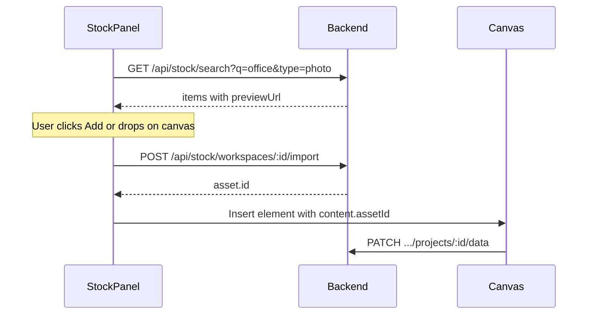

# Stock Media — Frontend Integration Guide

Use this guide to add a **Stock** tab in the video editor (Pexels MVP). Canonical HTTP contracts: [`docs/api/STOCK_API.md`](api/STOCK_API.md).

---

## Overview

| Phase | User action | Backend |
|-------|-------------|---------|
| Browse | Search in Stock panel | `GET /api/stock/search` — photos: `previewUrl`; videos: `previewUrl` + `previewVideoUrl` for hover |
| Use | Drop on canvas / Add to project | `POST /api/stock/workspaces/:workspaceId/import` |
| Edit | Save project | `content.assetId` only (never provider CDN URL as primary ref) |
| Playback / render | Existing asset resolution | `assetId` → presigned S3 |

Imported stock items also appear in **My assets** (`GET /api/assets/:workspaceId?source=stock`).

---

## Auth

```http
Authorization: Bearer <accessToken>
```

Workspace import routes use the same access rules as asset upload (PRIVATE: owner only; TEAM: any member).

---

## Recommended UI flow



1. **Search** — debounce input (~300ms), support `type` toggle (photo / video), paginate with `page`.
2. **Preview grid** — photos: `previewUrl` on ``. Videos: poster from `previewUrl`; on hover play `previewVideoUrl` (muted `<video>`). These URLs may break later; that is acceptable for browse-only previews.
3. **Import on use** — when the user adds media, call import **before** inserting the clip. Show a loading state on the tile.
4. **Insert clip** — use returned `asset.id` as `content.assetId`. Do not store `previewUrl` in saved project JSON.
5. **Attribution** — display `asset.stockMetadata.attribution` (e.g. footer chip or export credits screen).

---

## API examples

### Search photos

```http
GET /api/stock/search?q=office&type=photo&page=1&perPage=20
Authorization: Bearer <token>
```

### Search videos

```http
GET /api/stock/search?q=nature&type=video&page=1
Authorization: Bearer <token>
```

### Import into workspace

```http
POST /api/stock/workspaces/{workspaceId}/import
Authorization: Bearer <token>
Content-Type: application/json

{
  "provider": "pexels",
  "externalId": "12345",
  "mediaType": "photo",
  "name": "Office desk"
}
```

Response `200`:

```json
{
  "success": true,
  "message": "Stock media imported successfully",
  "data": {
    "asset": {
      "id": "uuid",
      "name": "Office desk",
      "type": "image/jpeg",
      "url": "https://...",
      "source": "stock",
      "stockProvider": "pexels",
      "stockExternalId": "12345",
      "stockMetadata": {
        "photographer": "Jane Doe",
        "attribution": "Photo by Jane Doe on Pexels",
        "pageUrl": "https://www.pexels.com/photo/..."
      }
    }
  }
}
```

Re-importing the same item returns the same `asset.id` without duplicating storage.

---

## Editor JSON (after import)

**Image element:**

```json
{
  "type": "image",
  "content": { "assetId": "uuid-from-import", "mediaType": "image" },
  "style": { "objectFit": "cover" }
}
```

**Scene background:**

```json
"background": {
  "type": "image",
  "value": { "assetId": "uuid-from-import" }
}
```

**Frame fill:**

```json
"content": {
  "fill": {
    "assetId": "uuid-from-import",
    "objectFit": "cover"
  }
}
```

See [`PROJECT_EDITOR_INTEGRATION.md`](PROJECT_EDITOR_INTEGRATION.md) §5 and §9 for full element shapes.

---

## My assets panel

List workspace assets including stock imports:

```http
GET /api/assets/:workspaceId?source=stock
GET /api/assets/:workspaceId?source=upload
GET /api/assets/:workspaceId
```

Optional `take` / `skip` pagination (same as uploads).

---

## Error handling

| Status | UX suggestion |
|--------|----------------|
| **400** `Storage limit exceeded` | Prompt upgrade / delete assets |
| **400** `Stock media file exceeds...` | Pick a smaller item or type |
| **404** Item not found | Provider removed item; refresh search |
| **503** Not configured | Hide Stock tab or show admin message |
| **429** | Back off and retry search |

---

## Storage note

Imported stock counts against the workspace owner's storage quota (same as uploads). Large video imports may be slow — keep import loading UI until the API returns.

---

## Phase 2 (not in MVP)

Unsplash (photos) and Pixabay (photos + videos) will use the same search/import contract with additional `provider` values. No editor JSON changes expected.

---

## Checklist

- [ ] Stock tab calls search with Bearer token
- [ ] Import runs on add-to-canvas, not on search result hover
- [ ] Project save uses `assetId` only
- [ ] Attribution shown for Pexels items
- [ ] My assets can filter `source=stock`
- [ ] No blob or Pexels CDN URLs persisted in `project.data`

---

**Related:** [`docs/api/STOCK_API.md`](api/STOCK_API.md) · [`docs/api/ASSETS_API.md`](api/ASSETS_API.md) · [`PROJECT_EDITOR_INTEGRATION.md`](PROJECT_EDITOR_INTEGRATION.md)
