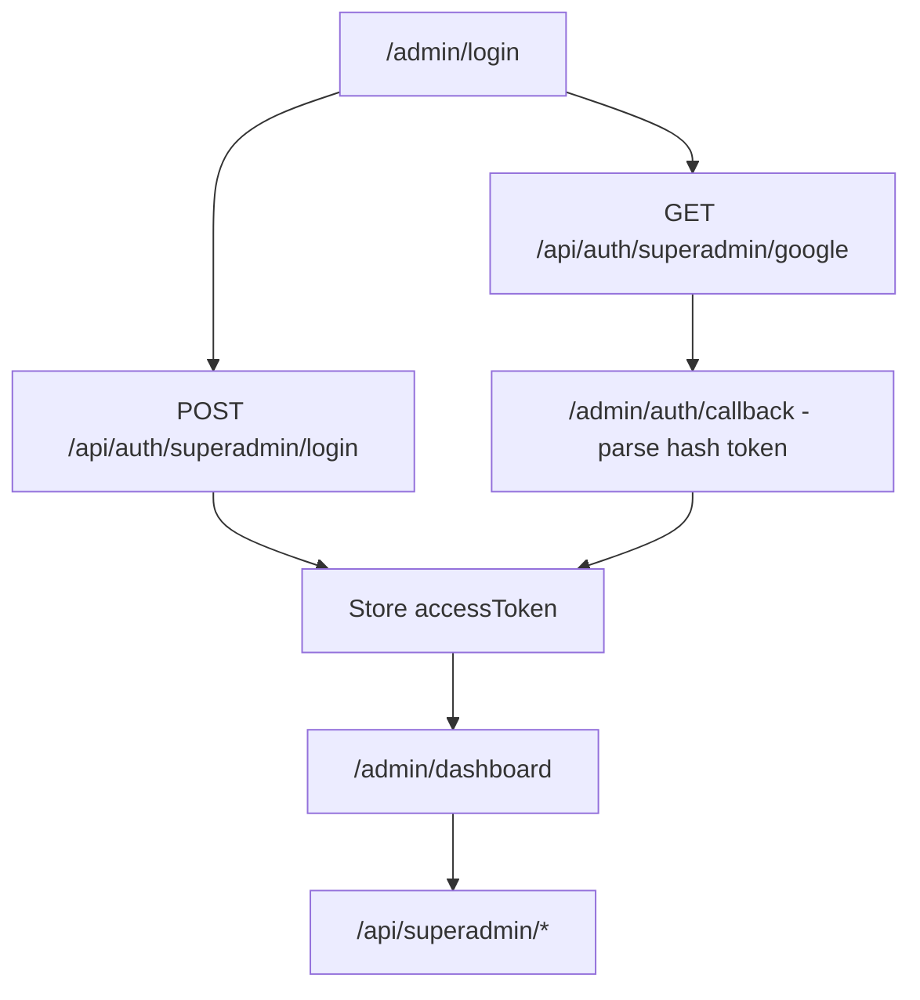
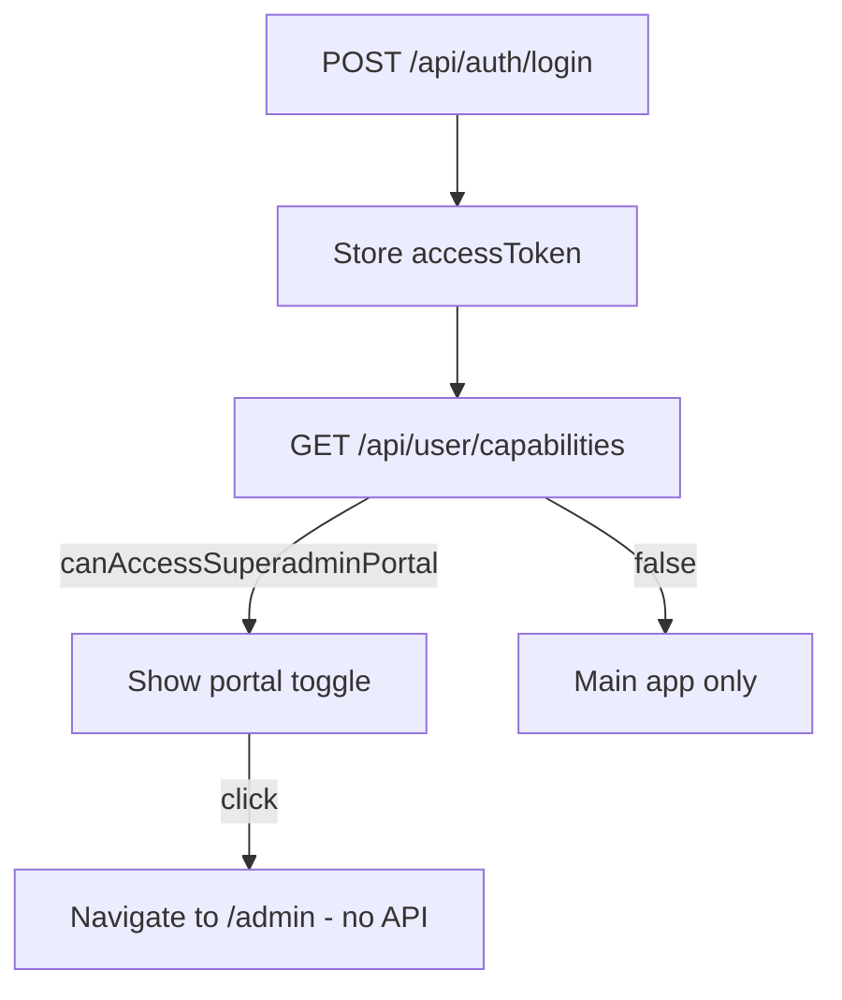

# Superadmin Portal — Frontend Integration Guide

This guide is for frontend developers building the **platform superadmin portal** and the **main app ↔ superadmin toggle**. It covers portal auth, capabilities, and credit admin APIs.

**Canonical HTTP contracts** (all backend routes): [`README.md`](../README.md)  
**Related:** [`PROJECT_EDITOR_INTEGRATION.md`](./PROJECT_EDITOR_INTEGRATION.md) (main editor app)

---

## Table of contents

1. [Concepts](#1-concepts)
2. [Prerequisites](#2-prerequisites)
3. [Response envelope](#3-response-envelope)
4. [Auth & portal flows](#4-auth--portal-flows)
5. [Capabilities (portal toggle)](#5-capabilities-portal-toggle)
6. [Token refresh & logout](#6-token-refresh--logout)
7. [Credit admin APIs](#7-credit-admin-apis)
8. [Recommended UI flows](#8-recommended-ui-flows)
9. [Error handling](#9-error-handling)
10. [Checklist](#10-checklist)

---

## 1. Concepts

| Term | Meaning |
|------|---------|
| **Platform superadmin** | User with `User.isPlatformSuperadmin = true` **or** email listed in server env `PLATFORM_SUPERADMIN_EMAILS` |
| **Superadmin portal** | Separate admin UI (e.g. `/admin/*`) for credit management |
| **Main platform** | Regular Athena VI app (workspaces, projects, editor) |
| **Portal toggle** | Client-side navigation between main app and superadmin shell — **same session**, no re-login |

**Important distinctions:**

- Platform superadmin ≠ workspace **ADMIN** role. Workspace roles apply under `/api/workspaces/*` only.
- Superadmin status is **not** in the JWT. The server checks the database (and email allowlist) on every `/api/superadmin/*` request.
- `isPlatformSuperadmin` / `canAccessSuperadminPortal` in API responses are for **UI only**. Never rely on them for security — the backend enforces access.

---

## 2. Prerequisites

| Requirement | Notes |
|-------------|--------|
| **API base URL** | e.g. `https://api.example.com` or `http://localhost:9000` |
| **Bearer access token** | `Authorization: Bearer <accessToken>` on all protected routes |
| **Refresh cookie** | httpOnly `refreshToken`; send with `credentials: 'include'` on refresh/logout |
| **CORS** | Frontend origin must be allowed (`FRONTEND_URL` or `CORS_ORIGINS` on server) |
| **Superadmin account** | User must already be a platform superadmin before superadmin login succeeds |

Default local API port: **9000**.

---

## 3. Response envelope

All JSON responses use the same shape:

**Success**

```json
{
  "success": true,
  "message": "Human-readable message",
  "data": { }
}
```

**Error**

```json
{
  "success": false,
  "message": "Error summary",
  "errors": []
}
```

Validation errors may populate `errors` with field-level detail.

---

## 4. Auth & portal flows

### 4.1 Superadmin portal login (email/password)

Use on the **dedicated superadmin login page** only.

```http
POST /api/auth/superadmin/login
Content-Type: application/json

{
  "email": "admin@company.com",
  "password": "yourPassword"
}
```

**200** — `data`:

```json
{
  "accessToken": "eyJhbG...",
  "user": { "name": "Admin", "email": "admin@company.com" },
  "isPlatformSuperadmin": true,
  "portal": "superadmin",
  "accountRecovered": false
}
```

A **refresh token** httpOnly cookie is set (same as normal login).

| Status | When |
|--------|------|
| **401** | Invalid email or password |
| **403** | Valid credentials but user is **not** a platform superadmin (`Platform superadmin access required`) |

### 4.2 Main platform login (unchanged)

```http
POST /api/auth/login
```

**200** — `data`: `{ "accessToken", "user": { "name", "email" }, "accountRecovered?" }`  
Does **not** include superadmin flags. Call [`GET /api/user/capabilities`](#5-capabilities-portal-toggle) after login to show the portal toggle.

### 4.3 Superadmin Google OAuth

**Start** — redirect the browser (no Bearer token):

```text
GET /api/auth/superadmin/google
```

Uses the **same** Google callback URL as main OAuth (`/api/auth/google/callback`). No extra Google Console redirect URI needed.

**On success** — backend redirects to:

```text
{FRONTEND_URL}{SUPERADMIN_OAUTH_SUCCESS_PATH}#access_token=<url-encoded-token>
```

Default `SUPERADMIN_OAUTH_SUCCESS_PATH`: `/admin/auth/callback`

**Frontend steps:**

1. Route `/admin/auth/callback` (or your configured path) in the superadmin app.
2. Parse `access_token` from the URL **hash** (not query).
3. Store token the same way as email login.
4. Refresh cookie is set automatically by the backend.

**On failure** — redirect to `{FRONTEND_URL}?error=<code>` (e.g. `Platform superadmin access required` for non-superadmin Google accounts).

### 4.4 Same token for both portals

Superadmin login and main login issue the **same JWT shape** (`sub` + `sessionId` only). One stored `accessToken` works for:

- `/api/workspaces/*` (main app)
- `/api/superadmin/*` (credit admin — server checks superadmin on each call)

---

## 5. Capabilities (portal toggle)

Call after **main platform** login, token refresh, or app shell load.

```http
GET /api/user/capabilities
Authorization: Bearer <accessToken>
```

**200** — `data`:

```json
{
  "isPlatformSuperadmin": true,
  "canAccessSuperadminPortal": true
}
```

For non-superadmin users, both fields are `false`.

**Toggle behavior:**

- If `canAccessSuperadminPortal` → show “Superadmin portal” control in main app.
- Clicking toggle → navigate to `/admin/*` (or your admin base path). **No API call.**
- From superadmin portal → “Back to platform” → navigate to main app routes. **No API call.**

---

## 6. Token refresh & logout

Same as the main app.

| Action | Request |
|--------|---------|
| Refresh access token | `POST /api/auth/refresh` with `credentials: 'include'` (cookie) |
| Logout (current device) | `POST /api/auth/logout` with `credentials: 'include'` |
| Logout all devices | `POST /api/auth/logout-all` with `Authorization: Bearer <accessToken>` |

After refresh on the main app, call `GET /api/user/capabilities` again if you need to refresh toggle visibility.

---

## 7. Credit admin APIs

**Base path:** `/api/superadmin`  
**Auth:** `Authorization: Bearer <accessToken>` + platform superadmin (enforced server-side)

**403** if the user is not a platform superadmin, even with a valid token.

Credits are in **AC** (Athena Credits) — positive integers unless noted.

### 7.1 List users with balances

```http
GET /api/superadmin/users?page=1&limit=20&search=optional@email.com
```

| Query | Default | Max |
|-------|---------|-----|
| `page` | 1 | — |
| `limit` | 20 | 100 |
| `search` | — | partial email match (case-insensitive) |

**200** — `data`:

```json
{
  "users": [
    {
      "id": "uuid",
      "email": "user@example.com",
      "name": "Jane Doe",
      "credits": 5000,
      "isPlatformSuperadmin": false,
      "createdAt": "2025-01-15T10:00:00.000Z"
    }
  ],
  "pagination": {
    "total": 42,
    "page": 1,
    "limit": 20,
    "totalPages": 3
  }
}
```

### 7.2 Get user personal balance

```http
GET /api/superadmin/users/:userId/credits
```

**200** — `data`:

```json
{
  "userId": "uuid",
  "email": "user@example.com",
  "name": "Jane Doe",
  "personalCredits": 5000
}
```

### 7.3 User credit history (full ledger)

```http
GET /api/superadmin/users/:userId/credits/history?page=1&limit=20&type=optional
```

| Query | Notes |
|-------|--------|
| `type` | Optional filter, e.g. `platform_grant`, `platform_revoke`, `usage`, `allocation`, `deallocation`, `refund` |

**200** — `data`:

```json
{
  "history": {
    "transactions": [
      {
        "id": "uuid",
        "userId": "uuid",
        "workspaceId": null,
        "amount": 1000,
        "type": "platform_grant",
        "scope": "user",
        "reference": "Promo Q1",
        "metadata": { "grantedByUserId": "admin-uuid", "reason": "Promo Q1" },
        "createdAt": "2025-02-01T12:00:00.000Z"
      }
    ],
    "pagination": {
      "total": 5,
      "page": 1,
      "limit": 20,
      "totalPages": 1
    }
  }
}
```

### 7.4 Grant credits to user

```http
POST /api/superadmin/users/:userId/credits/grant
Content-Type: application/json

{
  "amount": 1000,
  "reason": "Support adjustment"
}
```

| Field | Required | Rules |
|-------|----------|--------|
| `amount` | Yes | Positive integer (AC) |
| `reason` | No | Max 500 characters |

**200** — `data`:

```json
{
  "user": { "id": "uuid", "personalCredits": 6000 },
  "transaction": { "id": "uuid", "amount": 1000, "type": "platform_grant", ... }
}
```

### 7.5 Revoke credits from user

```http
POST /api/superadmin/users/:userId/credits/revoke
Content-Type: application/json

{
  "amount": 500,
  "reason": "Correction"
}
```

Same body rules as grant. User must have sufficient `personalCredits`.

| Status | When |
|--------|------|
| **402** | Insufficient credits (`INSUFFICIENT_CREDITS`) |

**200** — `data`: same shape as grant (`personalCredits` updated, `transaction` with negative amount).

### 7.6 Workspace credit pool summary

```http
GET /api/superadmin/workspaces/:workspaceId/credits
```

**200** — `data`:

```json
{
  "workspaceId": "uuid",
  "name": "Acme Team",
  "type": "TEAM",
  "workspaceCredits": 25000,
  "owner": {
    "id": "uuid",
    "email": "owner@example.com",
    "name": "Owner",
    "personalCredits": 1000
  },
  "memberCount": 8
}
```

### 7.7 Grant credits to workspace pool

Direct top-up to a **TEAM** workspace pool (does not deduct owner personal credits).

```http
POST /api/superadmin/workspaces/:workspaceId/credits/grant
Content-Type: application/json

{
  "amount": 5000,
  "reason": "Enterprise top-up"
}
```

**200** — `data`:

```json
{
  "workspace": { "id": "uuid", "workspaceCredits": 30000 },
  "transaction": { "id": "uuid", "amount": 5000, "type": "platform_grant", ... }
}
```

### 7.8 Usage report

Aggregates **usage** transactions (HeyGen, renders, etc.).

```http
GET /api/superadmin/reports/credits/usage?from=2025-01-01&to=2025-01-31&workspaceId=optional&userId=optional
```

| Query | Format |
|-------|--------|
| `from`, `to` | ISO 8601 dates (optional) |
| `workspaceId`, `userId` | UUID (optional filters) |

**200** — `data`:

```json
{
  "report": {
    "transactionCount": 150,
    "totalUsageAc": 42000,
    "estimatedHeygenUsd": 12.5
  }
}
```

---

## 8. Recommended UI flows

### Superadmin portal entry



### Main app with toggle



### Suggested superadmin screens

| Screen | API |
|--------|-----|
| User list + search | `GET /api/superadmin/users` |
| User detail / balance | `GET /api/superadmin/users/:userId/credits` |
| User ledger | `GET /api/superadmin/users/:userId/credits/history` |
| Grant / revoke modal | `POST .../grant` or `POST .../revoke` |
| Workspace pool view | `GET /api/superadmin/workspaces/:workspaceId/credits` |
| Workspace top-up | `POST /api/superadmin/workspaces/:workspaceId/credits/grant` |
| Usage dashboard | `GET /api/superadmin/reports/credits/usage` |

---

## 9. Error handling

| Status | Typical cause | Frontend action |
|--------|---------------|-----------------|
| **401** | Missing/expired token | Call `POST /api/auth/refresh` or redirect to login |
| **403** | Not platform superadmin | Hide superadmin UI; show “access denied” on admin routes |
| **400** | Validation (bad UUID, amount, etc.) | Show `message` / `errors` from response |
| **402** | Insufficient credits on revoke | Show balance error; refresh user balance |
| **404** | User or workspace not found | Show not-found state |

**Superadmin login 403** means credentials were valid but the account is not a superadmin — show a clear “not authorized for admin portal” message, not “wrong password.”

**Example fetch wrapper:**

```javascript
async function superadminFetch(path, options = {}) {
  const res = await fetch(`${API_BASE}${path}`, {
    ...options,
    credentials: 'include',
    headers: {
      'Content-Type': 'application/json',
      Authorization: `Bearer ${getAccessToken()}`,
      ...options.headers,
    },
  });
  const body = await res.json();
  if (!body.success) {
    if (res.status === 401) await refreshOrRedirectLogin();
    if (res.status === 403) throw new Error('PLATFORM_SUPERADMIN_REQUIRED');
    throw new Error(body.message || 'Request failed');
  }
  return body.data;
}
```

---

## 10. Checklist

### Superadmin portal app

- [ ] Login page uses `POST /api/auth/superadmin/login` (not `/api/auth/login`)
- [ ] Google button links to `GET /api/auth/superadmin/google`
- [ ] OAuth callback route reads `#access_token` from hash
- [ ] All credit calls use `Authorization: Bearer` + `credentials: 'include'` where cookies matter
- [ ] Handle **403** on login and on every `/api/superadmin/*` call
- [ ] “Back to platform” is client-side navigation only

### Main platform app

- [ ] After login/refresh, call `GET /api/user/capabilities`
- [ ] Show portal toggle only when `canAccessSuperadminPortal === true`
- [ ] Toggle does not call login again — reuse stored token

### Both

- [ ] Token refresh via `POST /api/auth/refresh` with cookies
- [ ] Do not decode JWT for superadmin role — use capabilities endpoint or API responses
- [ ] Workspace ADMIN role does not imply superadmin access

---

**Questions?** See full backend docs in [`README.md`](../README.md) → Platform Superadmin API, Auth API, User API.
