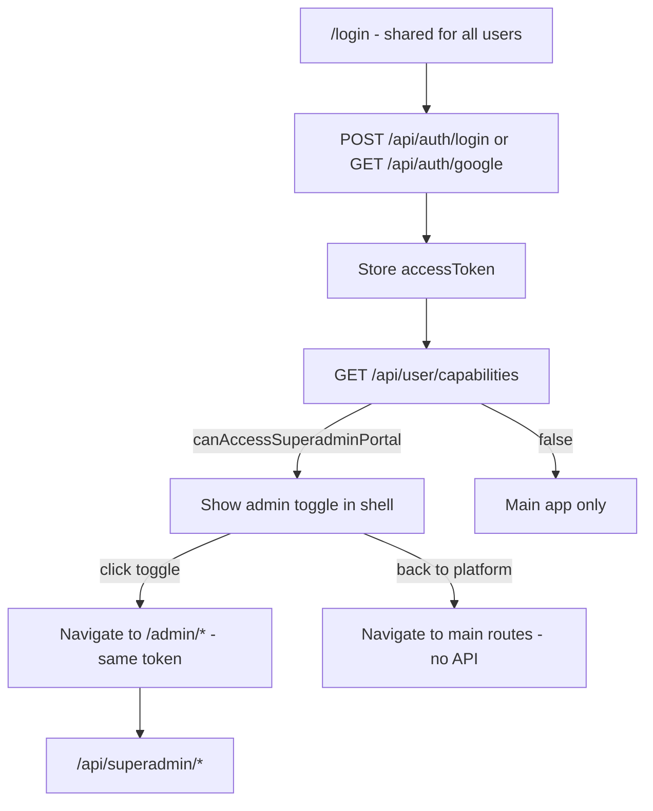

# Superadmin Portal — Frontend Integration Guide

This guide is for frontend developers building the **superadmin credit and storage admin UI** inside the same app as the main platform. There is **one shared login page** — superadmins use normal login, then switch to the admin section via a toggle. It covers capabilities, toggle behavior, and credit admin APIs.

**Canonical HTTP contracts** (all backend routes): [`docs/api/README.md`](api/README.md) · [Auth](api/AUTH_API.md) · [Superadmin](api/SUPERADMIN_API.md) · [User](api/USER_API.md)  
**Related:** [`PROJECT_EDITOR_INTEGRATION.md`](./PROJECT_EDITOR_INTEGRATION.md) (main editor app) · [`CREDITS_FRONTEND_INTEGRATION.md`](./CREDITS_FRONTEND_INTEGRATION.md) (main app credits UX) · [`STORAGE_API.md`](api/STORAGE_API.md) (user storage + upgrade requests)

---

## Table of contents

1. [Concepts](#1-concepts)
2. [Prerequisites](#2-prerequisites)
3. [Response envelope](#3-response-envelope)
4. [Auth & portal flows](#4-auth--portal-flows)
5. [Capabilities (portal toggle)](#5-capabilities-portal-toggle)
6. [Token refresh & logout](#6-token-refresh--logout)
7. [Credit admin APIs](#7-credit-admin-apis)
8. [Storage admin APIs](#8-storage-admin-apis)
9. [Recommended UI flows](#9-recommended-ui-flows)
10. [Error handling](#10-error-handling)
11. [Checklist](#11-checklist)

---

## 1. Concepts

| Term | Meaning |
|------|---------|
| **Platform superadmin** | User with `User.isPlatformSuperadmin = true` **or** email listed in server env `PLATFORM_SUPERADMIN_EMAILS` |
| **Superadmin section** | Admin UI routes (e.g. `/admin/*`) for credit management — **same app**, not a separate login |
| **Main platform** | Regular Athena VI app (workspaces, projects, editor) |
| **Portal toggle** | Client-side navigation between main app and admin section — **same session**, no re-login |

**Important distinctions:**

- Platform superadmin ≠ workspace **ADMIN** role. Workspace roles apply under `/api/workspaces/*` only.
- Superadmin status is **not** in the JWT. The server checks the database (and email allowlist) on every `/api/superadmin/*` request.
- `isPlatformSuperadmin` / `canAccessSuperadminPortal` in API responses are for **UI only**. Never rely on them for security — the backend enforces access.

---

## 2. Prerequisites

| Requirement | Notes |
|-------------|--------|
| **API base URL** | e.g. `https://api.example.com` or `http://localhost:9000` |
| **Bearer access token** | `Authorization: Bearer <accessToken>` on all protected routes |
| **Refresh cookie** | httpOnly `refreshToken`; send with `credentials: 'include'` on refresh/logout |
| **CORS** | Frontend origin must be allowed (`FRONTEND_URL` or `CORS_ORIGINS` on server) |
| **Superadmin account** | User must be a platform superadmin (DB flag or `PLATFORM_SUPERADMIN_EMAILS`) to access `/api/superadmin/*` |

Default local API port: **9000**.

---

## 3. Response envelope

All JSON responses use the same shape:

**Success**

```json
{
  "success": true,
  "message": "Human-readable message",
  "data": { }
}
```

**Error**

```json
{
  "success": false,
  "message": "Error summary",
  "errors": []
}
```

Validation errors may populate `errors` with field-level detail.

---

## 4. Auth & portal flows

### Single login page (recommended — our setup)

Everyone uses the **same login page** and the **same auth endpoints**. Superadmins are not identified at login time.

**Email/password**

```http
POST /api/auth/login
Content-Type: application/json

{
  "email": "user@example.com",
  "password": "yourPassword"
}
```

**200** — `data`: `{ "accessToken", "user": { "name", "email" }, "accountRecovered?" }`

**Google OAuth** — redirect to `GET /api/auth/google` (not `/api/auth/superadmin/google`). Callback: `{FRONTEND_URL}{OAUTH_SUCCESS_PATH}#access_token=...` (default `/auth/callback`).

**Immediately after login** (and after token refresh), call capabilities:

```http
GET /api/user/capabilities
Authorization: Bearer <accessToken>
```

If `canAccessSuperadminPortal === true`, show the **admin toggle** in the app shell. If `false`, hide it — regular users never see admin UI.

**Toggle to admin section** — navigate to `/admin/*` (or your admin routes). **No second login.** Use the same stored `accessToken` for `/api/superadmin/*`.

**Route guard on `/admin/*`** — before rendering admin pages, ensure capabilities were loaded and `canAccessSuperadminPortal` is true; otherwise redirect to main app. The API still returns **403** if someone deep-links without permission.

### Same token everywhere

Login issues a JWT with `{ sub, sessionId }` only. One `accessToken` works for:

- `/api/workspaces/*`, `/api/credits/*`, etc. (main app)
- `/api/superadmin/*` (credit admin — server checks superadmin on **every** request)

### Optional: separate superadmin login routes

The backend also exposes `POST /api/auth/superadmin/login` and `GET /api/auth/superadmin/google` for products that want a **dedicated admin login page** (rejects non-superadmins at login with **403**). **Do not use these** if you have a single shared login page — they are not required for the toggle flow.

---

## 5. Capabilities (portal toggle)

Call after **main platform** login, token refresh, or app shell load.

```http
GET /api/user/capabilities
Authorization: Bearer <accessToken>
```

**200** — `data`:

```json
{
  "isPlatformSuperadmin": true,
  "canAccessSuperadminPortal": true
}
```

For non-superadmin users, both fields are `false`.

**Toggle behavior:**

- If `canAccessSuperadminPortal` → show “Superadmin portal” control in main app.
- Clicking toggle → navigate to `/admin/*` (or your admin base path). **No API call.**
- From superadmin portal → “Back to platform” → navigate to main app routes. **No API call.**

---

## 6. Token refresh & logout

Same as the main app.

| Action | Request |
|--------|---------|
| Refresh access token | `POST /api/auth/refresh` with `credentials: 'include'` (cookie) |
| Logout (current device) | `POST /api/auth/logout` with `credentials: 'include'` |
| Logout all devices | `POST /api/auth/logout-all` with `Authorization: Bearer <accessToken>` |

After refresh on the main app, call `GET /api/user/capabilities` again if you need to refresh toggle visibility.

---

## 7. Credit admin APIs

**Base path:** `/api/superadmin`  
**Auth:** `Authorization: Bearer <accessToken>` + platform superadmin (enforced server-side)

**403** if the user is not a platform superadmin, even with a valid token.

Credits are in **AC** (Athena Credits) — positive integers unless noted.

### 7.1 List users with balances

```http
GET /api/superadmin/users?page=1&limit=20&search=optional@email.com
```

| Query | Default | Max |
|-------|---------|-----|
| `page` | 1 | — |
| `limit` | 20 | 100 |
| `search` | — | partial email match (case-insensitive) |

**200** — `data`:

```json
{
  "users": [
    {
      "id": "uuid",
      "email": "user@example.com",
      "name": "Jane Doe",
      "credits": 5000,
      "storageLimit": 1073741824,
      "storageUsed": 123456789,
      "isPlatformSuperadmin": false,
      "createdAt": "2025-01-15T10:00:00.000Z"
    }
  ],
  "pagination": {
    "total": 42,
    "page": 1,
    "limit": 20,
    "totalPages": 3
  }
}
```

### 7.2 Get user personal balance

```http
GET /api/superadmin/users/:userId/credits
```

**200** — `data`:

```json
{
  "userId": "uuid",
  "email": "user@example.com",
  "name": "Jane Doe",
  "personalCredits": 5000
}
```

### 7.3 User credit history (full ledger)

```http
GET /api/superadmin/users/:userId/credits/history?page=1&limit=20&type=optional
```

| Query | Notes |
|-------|--------|
| `type` | Optional filter, e.g. `platform_grant`, `platform_revoke`, `usage`, `allocation`, `deallocation`, `refund` |

**200** — `data`:

```json
{
  "history": {
    "transactions": [
      {
        "id": "uuid",
        "userId": "uuid",
        "workspaceId": null,
        "amount": 1000,
        "type": "platform_grant",
        "scope": "user",
        "reference": "Promo Q1",
        "metadata": { "grantedByUserId": "admin-uuid", "reason": "Promo Q1" },
        "createdAt": "2025-02-01T12:00:00.000Z"
      }
    ],
    "pagination": {
      "total": 5,
      "page": 1,
      "limit": 20,
      "totalPages": 1
    }
  }
}
```

### 7.4 Grant credits to user

```http
POST /api/superadmin/users/:userId/credits/grant
Content-Type: application/json

{
  "amount": 1000,
  "reason": "Support adjustment"
}
```

| Field | Required | Rules |
|-------|----------|--------|
| `amount` | Yes | Positive integer (AC) |
| `reason` | No | Max 500 characters |

**200** — `data`:

```json
{
  "user": { "id": "uuid", "personalCredits": 6000 },
  "transaction": { "id": "uuid", "amount": 1000, "type": "platform_grant", ... }
}
```

### 7.5 Revoke credits from user

```http
POST /api/superadmin/users/:userId/credits/revoke
Content-Type: application/json

{
  "amount": 500,
  "reason": "Correction"
}
```

Same body rules as grant. User must have sufficient `personalCredits`.

| Status | When |
|--------|------|
| **402** | Insufficient credits (`INSUFFICIENT_CREDITS`) |

**200** — `data`: same shape as grant (`personalCredits` updated, `transaction` with negative amount).

### 7.6 Workspace credit pool summary

```http
GET /api/superadmin/workspaces/:workspaceId/credits
```

**200** — `data`:

```json
{
  "workspaceId": "uuid",
  "name": "Acme Team",
  "type": "TEAM",
  "workspaceCredits": 25000,
  "owner": {
    "id": "uuid",
    "email": "owner@example.com",
    "name": "Owner",
    "personalCredits": 1000
  },
  "memberCount": 8
}
```

### 7.7 Grant credits to workspace pool

Direct top-up to a **TEAM** workspace pool (does not deduct owner personal credits).

```http
POST /api/superadmin/workspaces/:workspaceId/credits/grant
Content-Type: application/json

{
  "amount": 5000,
  "reason": "Enterprise top-up"
}
```

**200** — `data`:

```json
{
  "workspace": { "id": "uuid", "workspaceCredits": 30000 },
  "transaction": { "id": "uuid", "amount": 5000, "type": "platform_grant", ... }
}
```

### 7.8 Usage report

Aggregates **usage** transactions (HeyGen, renders, etc.).

```http
GET /api/superadmin/reports/credits/usage?from=2025-01-01&to=2025-01-31&workspaceId=optional&userId=optional
```

| Query | Format |
|-------|--------|
| `from`, `to` | ISO 8601 dates (optional) |
| `workspaceId`, `userId` | UUID (optional filters) |

**200** — `data`:

```json
{
  "report": {
    "transactionCount": 150,
    "totalUsageAc": 42000,
    "estimatedHeygenUsd": 12.5
  }
}
```

### 7.9 HeyGen API wallet (platform balance)

Shows **HeyGen-side** prepaid USD remaining (what Athena pays HeyGen), not Athena customer credits.

Uses server env **`HEYGEN_API_KEY`** → HeyGen **`GET /v3/users/me`**.

```http
GET /api/superadmin/heygen/account
Authorization: Bearer <accessToken>
```

**200** — `data.account`:

```json
{
  "billingType": "wallet",
  "wallet": {
    "currency": "usd",
    "remainingBalanceUsd": 42.5,
    "autoReload": { "enabled": false }
  },
  "email": "team@example.com",
  "fetchedAt": "2026-06-05T12:00:00.000Z"
}
```

**UI:** Show **`wallet.remainingBalanceUsd`** as “HeyGen balance (USD)” on the admin dashboard. Refresh on load and optionally on a timer. If `billingType === 'subscription'`, show enterprise credit pools from `subscription.credits` instead.

**500** — `HEYGEN_API_KEY` not configured on the server.

---

## 8. Storage admin APIs

**Base path:** `/api/superadmin` (same auth as credits)

Storage quotas are in **bytes** (binary: 1 GiB = `1073741824`). API JSON uses **numbers**. There is **no fixed upper cap** on grant/revoke amounts — any positive integer is accepted.

### 8.1 List users (storage columns)

`GET /api/superadmin/users` — each user includes `storageLimit` and `storageUsed` (bytes) in addition to `credits`.

### 8.2 Get user storage summary

```http
GET /api/superadmin/users/:userId/storage
```

**200** — same fields as main-app `GET /api/user/storage`: `limitBytes`, `usedBytes`, `availableBytes`, `percentUsed`, `tier`, `activeUpgradeRequest`.

### 8.3 Grant storage

```http
POST /api/superadmin/users/:userId/storage/grant
Content-Type: application/json
```

**Option A — preset tier (sets absolute limit):**

```json
{ "tierId": "plus_10gb", "reason": "Support ticket" }
```

| `tierId` | Bytes |
|----------|-------|
| `free` | `1073741824` |
| `plus_10gb` | `10737418240` |
| `pro_50gb` | `53687091200` |

**Option B — add any amount (increments current limit):**

```json
{ "additionalBytes": 107374182400, "reason": "Enterprise deal" }
```

Send **one** mode per request (`tierId` **or** `additionalBytes`).

**200** — `data.user.storageLimit`, `data.user.storageUsed`, `data.transaction.amountBytes`.

Auto-approves the user's latest pending storage upgrade request when present.

### 8.4 Revoke storage

```http
POST /api/superadmin/users/:userId/storage/revoke
Content-Type: application/json

{ "amountBytes": 1073741824, "reason": "Downgrade" }
```

**400** if new limit would fall below `storageUsed`.

### 8.5 Storage tiers reference

```http
GET /api/superadmin/storage/tiers
```

Use before grant UI to populate tier dropdown (`id`, `label`, `limitBytes`).

### 8.6 Storage upgrade queue

```http
GET /api/superadmin/storage/requests?status=pending&page=1&limit=20
POST /api/superadmin/storage/requests/:requestId/reject
Content-Type: application/json

{ "reviewNote": "Optional message to user" }
```

Superadmins also receive `PLATFORM_STORAGE_UPGRADE_REQUEST` inbox notifications (`GET /api/user/inbox?category=platform`).

### 8.7 User storage history

```http
GET /api/superadmin/users/:userId/storage/history?page=1&limit=20&type=optional
```

### 8.8 Display helper

```javascript
const GIB = 1024 ** 3;
function formatBytes(bytes) {
  if (bytes >= GIB) return `${(bytes / GIB).toFixed(1)} GiB`;
  if (bytes >= 1024 ** 2) return `${(bytes / 1024 ** 2).toFixed(1)} MiB`;
  return `${bytes} B`;
}
```

---

## 9. Workspace admin APIs

```http
GET /api/superadmin/workspaces?page=1&limit=20&search=acme
GET /api/superadmin/workspaces/:workspaceId/credits/history?page=1&limit=20
GET /api/superadmin/workspaces/:workspaceId/credits/usage-by-member?page=1&limit=20
POST /api/superadmin/workspaces/:workspaceId/credits/revoke
Content-Type: application/json

{ "amount": 500, "reason": "Correction" }
```

---

## 10. Reports and platform access

### Extended usage report

`GET /api/superadmin/reports/credits/usage?from=...&to=...&topLimit=10`

Response `data.report` includes `byFeature`, `byDay`, `topUsers`, `topWorkspaces` in addition to totals.

### Platform actions audit

`GET /api/superadmin/reports/credits/platform-actions?page=1&limit=20&scope=workspace`

### Manage superadmin flag

```http
PATCH /api/superadmin/users/:userId/platform-access
Content-Type: application/json

{ "isPlatformSuperadmin": true }
```

**400** if demoting yourself or the last superadmin. Env `PLATFORM_SUPERADMIN_EMAILS` still grants access independently.

---

## 11. Recommended UI flows

### Single login + toggle (our setup)



### Suggested superadmin screens

| Screen | API |
|--------|-----|
| User list + search | `GET /api/superadmin/users` |
| User detail / balance | `GET /api/superadmin/users/:userId/credits` |
| User storage quota | `GET /api/superadmin/users/:userId/storage` |
| User credit ledger | `GET /api/superadmin/users/:userId/credits/history` |
| User storage ledger | `GET /api/superadmin/users/:userId/storage/history` |
| Grant / revoke credits | `POST .../credits/grant` or `POST .../credits/revoke` |
| Grant / revoke storage | `POST .../storage/grant` or `POST .../storage/revoke` |
| Storage tier presets | `GET /api/superadmin/storage/tiers` |
| Storage upgrade queue | `GET /api/superadmin/storage/requests` |
| Reject storage request | `POST /api/superadmin/storage/requests/:requestId/reject` |
| Workspace list | `GET /api/superadmin/workspaces` |
| Workspace pool view | `GET /api/superadmin/workspaces/:workspaceId/credits` |
| Workspace ledger / usage | `GET .../credits/history`, `GET .../credits/usage-by-member` |
| Workspace top-up / revoke | `POST .../credits/grant`, `POST .../credits/revoke` |
| Usage dashboard | `GET /api/superadmin/reports/credits/usage` |
| Platform actions audit | `GET /api/superadmin/reports/credits/platform-actions` |
| Platform access toggle | `PATCH /api/superadmin/users/:userId/platform-access` |
| Platform alerts + HeyGen wallet | `GET /api/superadmin/alerts/summary` |
| Early access queue | `GET /api/superadmin/early-access/requests` |
| Early access status update | `PATCH .../early-access/requests/:requestId/status` with `{ "status": "under_review" }` |
| Early access approve / reject | `POST .../early-access/requests/:requestId/approve` or `.../reject` |
| HeyGen USD wallet | `GET /api/superadmin/heygen/account` |
| Product email broadcast | `POST /api/superadmin/broadcasts/product-email` |
| Product email broadcast history | `GET /api/superadmin/broadcasts/product-email` |
| Broadcast detail + recipients | `GET .../broadcasts/product-email/:broadcastId`, `GET .../recipients` |

---

## 12. Error handling

| Status | Typical cause | Frontend action |
|--------|---------------|-----------------|
| **401** | Missing/expired token | Call `POST /api/auth/refresh` or redirect to login |
| **403** | Not platform superadmin | Hide superadmin UI; show “access denied” on admin routes |
| **400** | Validation (bad UUID, amount, revoke below used storage, etc.) | Show `message` / `errors` from response |
| **402** | Insufficient credits on revoke | Show balance error; refresh user balance |
| **404** | User or workspace not found | Show not-found state |

**403 on `/api/superadmin/*`** — user is logged in but not a platform superadmin. Redirect to main app or show access denied. With a single login page, regular users should never reach admin routes if the toggle is hidden and route guards are in place.

**Example fetch wrapper:**

```javascript
async function superadminFetch(path, options = {}) {
  const res = await fetch(`${API_BASE}${path}`, {
    ...options,
    credentials: 'include',
    headers: {
      'Content-Type': 'application/json',
      Authorization: `Bearer ${getAccessToken()}`,
      ...options.headers,
    },
  });
  const body = await res.json();
  if (!body.success) {
    if (res.status === 401) await refreshOrRedirectLogin();
    if (res.status === 403) throw new Error('PLATFORM_SUPERADMIN_REQUIRED');
    throw new Error(body.message || 'Request failed');
  }
  return body.data;
}
```

---

## 13. Checklist

### Single app (one login page)

- [ ] Login uses `POST /api/auth/login` or `GET /api/auth/google` only — **not** `/api/auth/superadmin/*`
- [ ] After login and after `POST /api/auth/refresh`, call `GET /api/user/capabilities`
- [ ] Show admin toggle only when `canAccessSuperadminPortal === true`
- [ ] Toggle navigates to `/admin/*` — **no second login**, same `accessToken`
- [ ] Guard `/admin/*` routes (redirect if capabilities false)
- [ ] All `/api/superadmin/*` calls use `Authorization: Bearer` + `credentials: 'include'` where cookies matter
- [ ] Handle **403** on credit admin API calls
- [ ] Storage upgrade queue: `GET /api/superadmin/storage/requests`; reject via POST
- [ ] Workspace list before drilling into pool by `workspaceId`
- [ ] Usage report uses extended `byFeature` / `topUsers` fields when building dashboards
- [ ] Product email broadcast: `POST /api/superadmin/broadcasts/product-email` with `confirm: "send"` (save `broadcastId` from response)
- [ ] Broadcast history UI: `GET /api/superadmin/broadcasts/product-email` + recipient log per broadcast
- [ ] “Back to platform” is client-side navigation only

### General

- [ ] Token refresh via `POST /api/auth/refresh` with cookies
- [ ] Do not decode JWT for superadmin role — use `GET /api/user/capabilities`
- [ ] Workspace ADMIN role does not imply superadmin access

---

**Questions?** See [`docs/api/SUPERADMIN_API.md`](api/SUPERADMIN_API.md), [`docs/api/AUTH_API.md`](api/AUTH_API.md), [`docs/api/USER_API.md`](api/USER_API.md).
